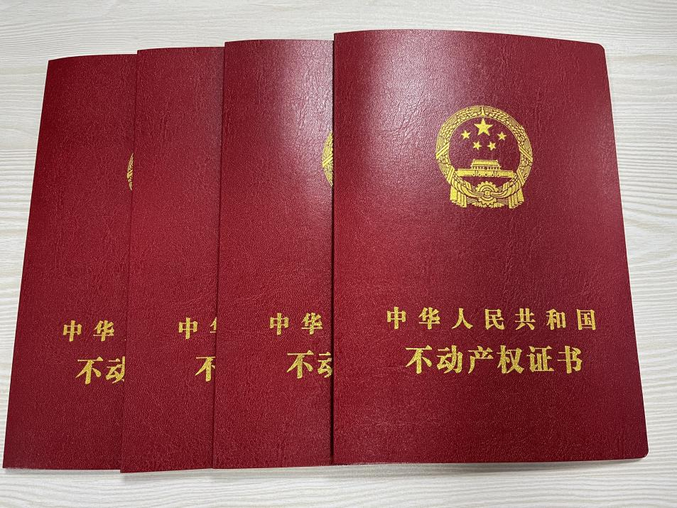

# 购房流程

贷款买房全部顺序流程
!千万不能乱!
第一步:看房，选房，砍价(首页有砍价攻略)第二步:交意向金，锁定房号
第三步:查个人征信、流水、问不同银行基点第四步:征信流水没问题，交定金
第五步:签合同，交首付
第六步:合同网签备案
第七步:签银行贷款合同
第八步:拿到全部手续(六样资料)
第九步:收房、验房
第十步:缴纳契税(办理房产证)第十一步:贷款还清后注销抵押第十二步:房子才真正属于你新手买房去售楼处这样问

## 看房，选房，砍价

> - 现场看房
>   - **房屋质量方面**，建议到现场查看**有无墙体裂缝、漏水、渗水、偷工减料、管道渗漏**等问题。
>   - 购房者应该上网查发展商资质，查验所选购的住房是否已**被抵押、查封**。
>   - 如果选购的住房是由房地产中介公司代理销售的，应了解该公司是否具有房地产中介资质等。
> - **有无预售资格，查看五证是否齐全。**

## 交意向金，锁定房号

## 收房、验房

> 验收也是一个大事，关乎于房屋质量的检测，建议大家找**专业的装修公司**一块去验收。

## 办理不动产证

> 最后就是办理最最重要的不动产证了有了这个红本本，房子才是真正属于你。
>
> 
