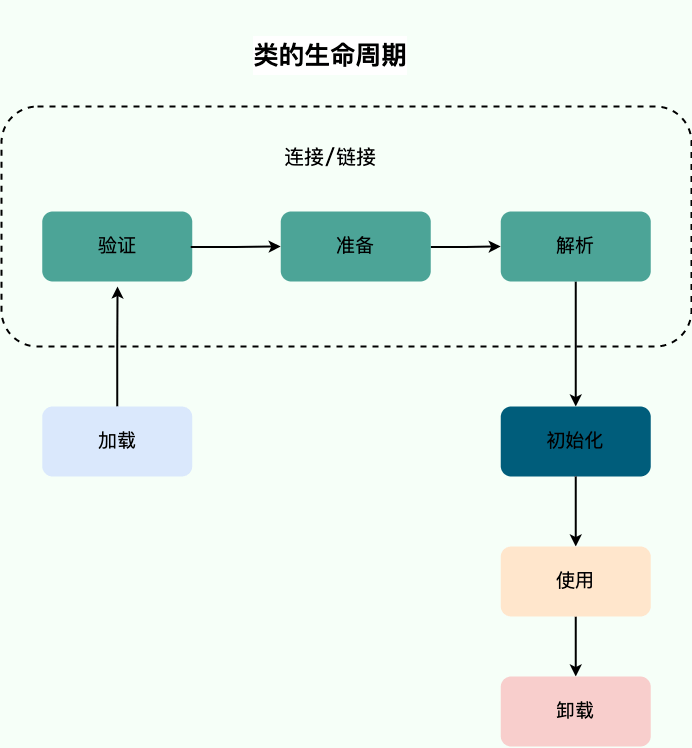

# Jvm

### 内存区域

### 对象

### 垃圾回收

------

### 类加载过程

> [!Tip]
>
> 类的生命周期

类从被加载到虚拟机内存中开始到卸载出内存为止，<u>它的整个生命周期可以简单概括为 7 个阶段</u>：

**加载**、**验证**、**准备**、**解析**、**初始化**、**使用**和**卸载**。其中，验证、准备和解析这三个阶段可以统称为连接。

这 7 个阶段的顺序如下图所示：

> [!Tip]
>
> 类加载过程

`什么是类的加载过程?`

一个Java文件从编码完成到最终运行，一般会经历两个阶段：编译期、运行期。编译，即通过javac命令，将Java文件转化为二进制字节码文件，即.class文件；运行，则是将.class文件交给JVM执行。而本文所说的类加载过程就是将.class文件中类的元信息加载进内存，创建Class对象并进行解析、初始化类变量等的过程。

`类加载详解`

系统加载 Class 类型的文件主要三步：**加载->连接->初始化**。连接过程又可分为三步：**验证->准备->解析**。

- `加载`

  类加载过程的第一步，主要完成下面 3 件事情：

  1. 通过全类名获取定义此类的二进制字节流。
  2. 将字节流所代表的静态存储结构转换为方法区的运行时数据结构。
  3. 在内存中生成一个代表该类的 `Class` 对象，作为方法区这些数据的访问入口。

- `连接`

  - `验证`

    **验证的过程只要是保证 class 文件的安全性和正确性**，确保加载了该 class 文件不会导致 JVM 出现任何异常，不会危害JVM 的自身安全。

    验证阶段主要由四个检验阶段组成：

    - 文件格式验证（Class 文件格式检查）
    - 元数据验证（字节码语义检查）
    - 字节码验证（程序语义检查）
    - 符号引用验证（类的正确性检查）

  - `准备`

    **准备阶段的主要任务是为类的类变量开辟空间并赋默认值**。

    - 静态变量是基本类型（int、long、short、char、byte、boolean、float、double）的默认值为0
    - 静态变量是引用类型的，默认值为null
    - 静态常量默认值为声明时设定的值

  - `解析`

    **该阶段的主要职责为将Class在常量池中的符号引用转变为直接引用**。

    **符号引用**即字符串，说白了可以是一个字段名，或者一个方法名；**直接引用**即偏移量，说白了就是类的元信息位于内存的地址串，例如，一个类的方法为test()，则符号引用即为test，这个方法存在于内存中的地址假设为0x123456，则这个地址则为直接引用。

- `初始化`

  **初始化阶段是执行初始化方法 `<clinit> ()` （<u>说明：`<clinit> ()`方法是编译之后自动生成的。</u>）方法的过程，是类加载的最后一步，这一步 JVM 才开始真正执行类中定义的 Java 程序代码(字节码)。**

> [!Tip]
>
> 类卸载（了解）

**卸载类即该类的 Class 对象被 GC。**

卸载类需要满足 3 个要求:

1. 该类的所有的实例对象都已被 GC，也就是说堆不存在该类的实例对象。
2. 该类没有在其他任何地方被引用
3. 该类的类加载器的实例已被 GC

所以，在 JVM 生命周期内，由 jvm 自带的类加载器加载的类是不会被卸载的。但是由我们自定义的类加载器加载的类是可能被卸载的。

只要想通一点就好了，JDK 自带的 `BootstrapClassLoader`, `ExtClassLoader`, `AppClassLoader` 负责加载 JDK 提供的类，所以它们(类加载器的实例)肯定不会被回收。而我们自定义的类加载器的实例是可以被回收的，所以使用我们自定义加载器加载的类是可以被卸载掉的。

------

### 类加载器

> [!Tip]
>
> 类加载器介绍

类加载器JVM 中内置了三个重要的 ClassLoader，除了 BootstrapClassLoader 其他类加载器均由 Java 实现且全部继承自`java.lang.ClassLoader`：

1. **BootstrapClassLoader(启动类加载器)** ：最顶层的加载类，由 C++实现，负责加载 `%JAVA_HOME%/lib`目录下的 jar 包和类或者被 `-Xbootclasspath`参数指定的路径中的所有类。
2. **ExtensionClassLoader(扩展类加载器)** ：主要负责加载 `%JRE_HOME%/lib/ext` 目录下的 jar 包和类，或被 `java.ext.dirs` 系统变量所指定的路径下的 jar 包。
3. **AppClassLoader(应用程序类加载器)** ：面向我们用户的加载器，负责加载当前应用 classpath 下的所有 jar 包和类。

> [!Tip]
>
> 双亲委派模型介绍

每一个类都有一个对应它的类加载器。系统中的 ClassLoader 在协同工作的时候会默认使用 **双亲委派模型** 。即在类加载的时候，系统会首先判断当前类是否被加载过。已经被加载的类会直接返回，否则才会尝试加载。加载的时候，首先会把该请求委派给父类加载器的 `loadClass()` 处理，因此所有的请求最终都应该传送到顶层的启动类加载器 `BootstrapClassLoader` 中。当父类加载器无法处理时，才由自己来处理。当父类加载器为 null 时，会使用启动类加载器 `BootstrapClassLoader` 作为父类加载器。

> [!Tip]
>
> 双亲委派模型的好处

双亲委派模型保证了 Java 程序的稳定运行，可以避免类的重复加载（JVM 区分不同类的方式不仅仅根据类名，相同的类文件被不同的类加载器加载产生的是两个不同的类），也保证了 Java 的核心 API 不被篡改。如果没有使用双亲委派模型，而是每个类加载器加载自己的话就会出现一些问题，比如我们编写一个称为 `java.lang.Object` 类的话，那么程序运行的时候，系统就会出现多个不同的 `Object` 类。

> [!Tip]
>
> 如果我们不想用双亲委派模型怎么办，自定义类加载器

**自定义加载器**的话，需要继承 `ClassLoader` 。如果我们不想打破双亲委派模型，就重写 `ClassLoader` 类中的 `findClass()` 方法即可，无法被父类加载器加载的类最终会通过这个方法被加载。但是，如果想打破双亲委派模型则需要重写 `loadClass()` 方法

> [!Tip]
>
> 那你知道有哪个场景破坏了双亲委派机制吗？（了解）

------

### JVM参数

### 监控和故障处理

### 问题排查和性能调优
