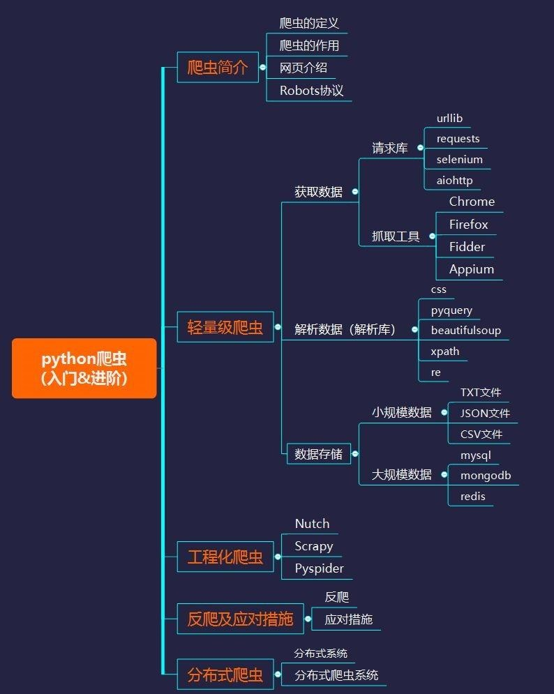
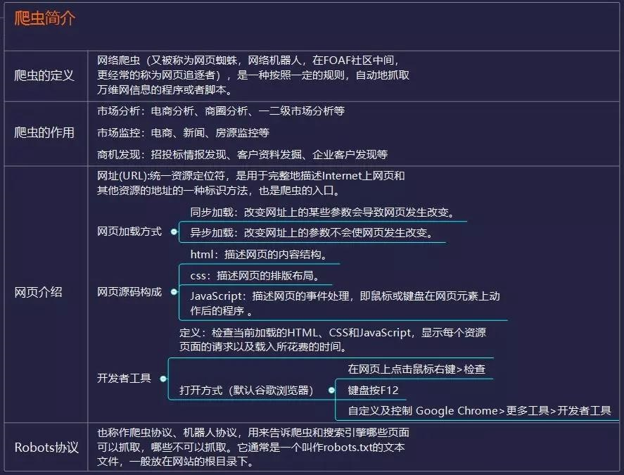
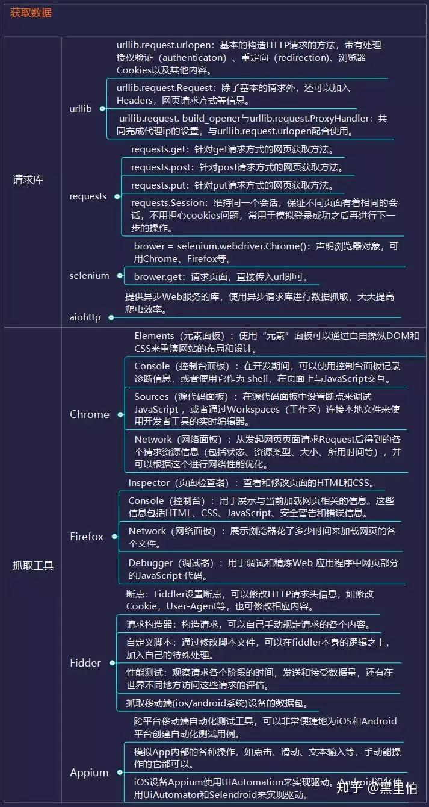
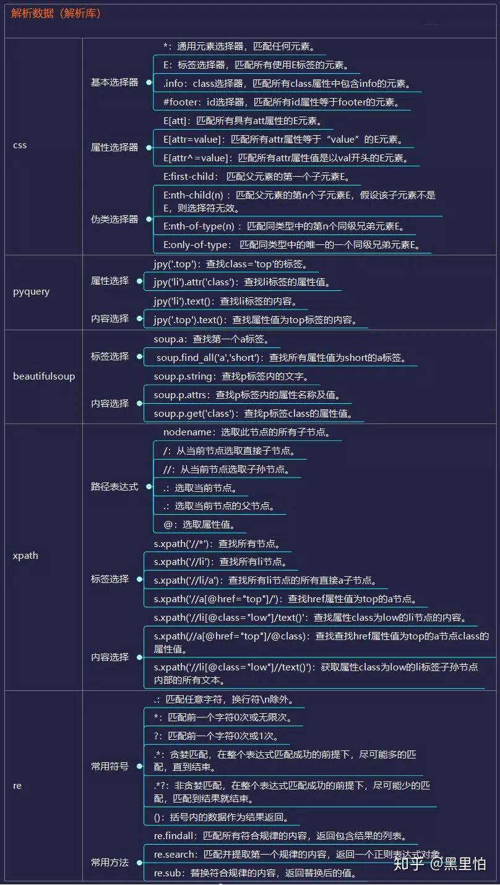
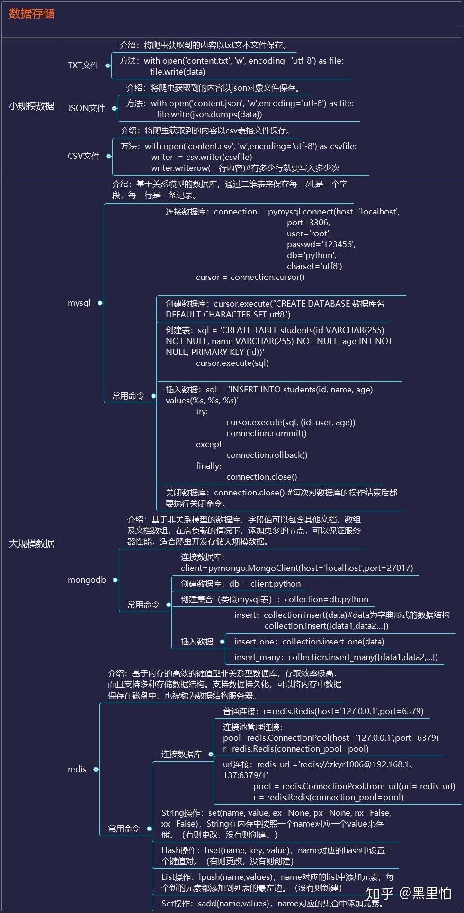
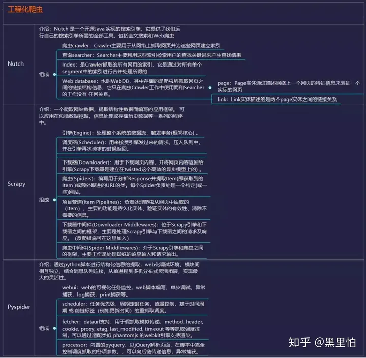
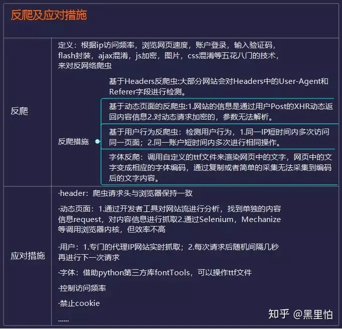
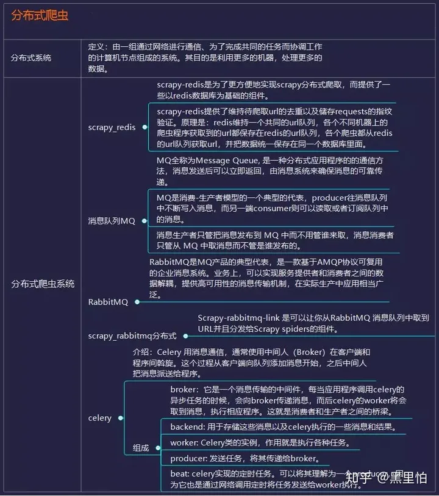

# Python

> 数据是决策的原材料，高质量的数据价值不菲，如何挖掘原材料成为互联网时代的先驱，掌握信息的源头，就能比别人更快一步。
>
> 大数据时代，互联网成为大量信息的载体，机械的复制粘贴不再实用，不仅耗时费力还极易出错，这时爬虫的出现解放了大家的双手，以其**高速爬行、定向抓取资源**的能力获得了大家的青睐。
>
> 爬虫变得越来越流行，不仅因为**它能够快速爬取海量的数据，更因为有python这样简单易用的语言使得爬虫能够快速上手**。
>
> 对于小白来说，爬虫可能是一件非常复杂、技术门槛很高的事情，但掌握正确的方法，在短时间内做到能够爬取主流网站的数据，其实非常容易实现，但建议你从**一开始就要有一个具体的目标。**
>
> 在目标的驱动下，你的学习才会更加精准和高效。**那些所有你认为必须的前置知识，都是可以在完成目标的过程中学到的。**
>
> 基于python爬虫，我们整理了一个完整的学习框架：
>
> 

### **爬虫简介**

> 爬虫是一种按照一定的规则，自动地抓取万维网信息的程序或者脚本。
>
> 这个定义看起来很生硬，我们换一种更好理解的解释：
>
> 我们作为用户获取网络数据的方式是浏览器提交请求->下载网页代码->解析/渲染成页面；而爬虫的方式是模拟浏览器发送请求->下载网页代码->只提取有用的数据->存放于数据库或文件中。
>
> 爬虫与我们的区别是，爬虫程序只提取网页代码中对我们有用的数据，并且爬虫抓取速度快，量级大。
>
> 随着数据的规模化，爬虫获取数据的高效性能越来越突出，能够做的事情越来越多：
>
> - 市场分析：电商分析、商圈分析、一二级市场分析等
> - 市场监控：电商、新闻、房源监控等
> - 商机发现：招投标情报发现、客户资料发掘、企业客户发现等
>
> 进行爬虫学习，首先要懂得是**网页**，那些我们肉眼可见的光鲜亮丽的网页是由**HTML、css、javascript等网页源码所支撑起来的。**
>
> 这些源码被浏览器所识别转换成我们看到的网页，这些源码里面必定存在着很多**规律**,**我们的爬虫就能按照这样的规律来爬取需要的信息。**
>
> 无规矩不成方圆，**Robots协议**就是爬虫中的规矩，它告诉爬虫和搜索引擎哪些页面可以抓取，哪些不可以抓取。
>
> 通常是一个叫作robots.txt的文本文件，放在网站的根目录下。
>
> 

### **轻量级爬虫**

> **“获取数据——解析数据——存储数据”**是爬虫的三部曲，大部分爬虫都是按这样的流程来进行，这其实也是模拟了我们使用浏览器获取网页信息的过程。
>
> **1、获取数据**
>
> **爬虫第一步操作就是模拟浏览器向服务器发送请求**，基于python，你不需要了解从数据的实现，HTTP、TCP、IP的网络传输结构，一直到服务器响应和应达的原理，因为**python提供了功能齐全的类库来帮我们完成这些请求。**
>
> Python自带的标准库**urllib2**使用的较多，它是python内置的HTTP请求库，如果你只进行基本的爬虫网页抓取，那么urllib2足够用。
>
> **Requests**的slogen是 “Requests is the only Non-GMO HTTP library for Python, safe for humanconsumption”，相对urllib2，requests使用起来确实简洁很多，并且**自带json解析器。**
>
> 如果你需要爬取异步加载的动态网站，可以学习浏览器**抓包分析真实请求或者学习Selenium来实现自动化。**
>
> 对于爬虫来说，在能够爬取到数据地前提下当然是越快越好，显然传统地同步代码不能满足我们对速度地需求。
>
> （ps：据国外数据统计：正常情况下我们请求同一个页面 100次的话，最少也得花费 30秒，但使用异步请求同一个页面 100次的话，只需要要 3秒左右。）
>
> **aiohttp是你值得拥有的一个库，**aiohttp的异步操作借助于async/await关键字的写法变得更加简洁，架构更加清晰。使用异步请求库进行数据抓取时，**会大大提高效率。**
>
> 你可以根据自己的需求选择合适的请求库，但建议先从python自带的urllib开始，当然，你可以在学习时尝试所有的方式，以便更了解这些库的使用。
>
> **推荐请求库资源:**
>
> - ***urllib2文档：**[https://dwz.cn/8hEGdsqD](https://link.zhihu.com/?target=https%3A//dwz.cn/8hEGdsqD)*
> - ***requests文档 ：***[http://t.cn/8Fq1aXrs](https://link.zhihu.com/?target=http%3A//t.cn/8Fq1aXrs)
> - ***elenium文档：**[https://dwz.cn/DlL9j9hf](https://link.zhihu.com/?target=https%3A//dwz.cn/DlL9j9hf)*
> - ***aiohttp文档：**[https://dwz.cn/hvndbuB4](https://link.zhihu.com/?target=https%3A//dwz.cn/hvndbuB4)*
>
> 
>
> **2、解析数据**
>
> 爬虫爬取的是爬取页面指定的部分数据值，而不是整个页面的数据，这时往往需要先进行数据的解析再进行存储。
>
> 从web上采集回来的数据的数据类型有很多种,主要有HTML、 javascript、JSON、XML等格式。解析库的使用等价于在HTML中查找需要的信息时时使用正则，能够更加快捷地定位到具体的元素获取相应的信息。**Css选择器**是一种快速定位元素的方法。**Pyqurrey**使用lxml解析器进行快速在xml和html文档上操作，它提供了和jQuery类似的语法来解析HTML文档，支持CSS选择器，使用非常方便。
>
> **Beautiful Soup**是借助网页的结构和属性等特性来解析网页的工具，能自动转换编码。支持Python标准库中的HTML解析器,还支持一些第三方的解析器。
>
> **Xpath**最初是用来搜寻XML文档的，但是它同样适用于HTML文档的搜索。它提供了超过 100 个内建的函数。这些函数用于字符串值、数值、日期和时间比较、节点和 QName 处理、序列处理、逻辑值等等，并且XQuery和XPointer都构建于XPath基础上。
>
> **Re**正则表达式通常被用来检索、替换那些符合某个模式(规则)的文本。个人认为前端基础比较扎实的，用pyquery是最方便的，beautifulsoup也不错，re速度比较快，但是写正则比较麻烦。当然了，既然用python，肯定还是自己用着方便最好。
>
> ***推荐解析器资源：***
>
> - ***pyquery*** [https://dwz.cn/1EwUKsEG](https://link.zhihu.com/?target=https%3A//dwz.cn/1EwUKsEG)
> - ***Beautifulsoup** [http://t.im/ddfv](https://link.zhihu.com/?target=http%3A//t.im/ddfv)*
> - ***xpath教程*** [http://t.im/ddg2](https://link.zhihu.com/?target=http%3A//t.im/ddg2)
> - ***re文档** [http://t.im/ddg6](https://link.zhihu.com/?target=http%3A//t.im/ddg6)*
>
> 
>
> **3、数据存储**
>
> 当爬回来的数据量较小时，你可以使用文档的形式来储存，支持TXT、json、csv等格式。但当数据量变大，文档的储存方式就行不通了，**所以掌握一种数据库是必须的。**
>
> **Mysql** 作为关系型数据库的代表，拥有较为成熟的体系，成熟度很高，可以很好地去存储一些数据，但在在海量数据处理的时候效率会显著变慢，已然满足不了某些大数据的处理要求。
>
> **MongoDB**已经流行了很长一段时间，相对于MySQL ，MongoDB可以方便你去存储一些非结构化的数据，比如各种评论的文本，图片的链接等等。你也可以利用PyMongo，更方便地在Python中操作MongoDB。因为这里要用到的数据库知识其实非常简单，主要是**数据如何入库、如何进行提取**，在需要的时候再学习就行。
>
> **Redis是一个不折不扣的内存数据库，**Redis 支持的数据结构丰富，包括hash、set、list等。数据全部存在内存，访问速度快，可以存储大量的数据，一般应用于分布式爬虫的数据存储当中。
>
> ***推荐数据库资源：***
>
> - ***mysql文档** [https://dev.mysql.com/doc/](https://link.zhihu.com/?target=https%3A//dev.mysql.com/doc/)*
> - ***mongoDB文档** [https://docs.mongodb.com/](https://link.zhihu.com/?target=https%3A//docs.mongodb.com/)*
> - ***redis文档** [https://redis.io/documentation/](https://link.zhihu.com/?target=https%3A//redis.io/documentation/)*
>
> 

### **工程化爬虫**

> 掌握前面的技术你就可以实现轻量级的爬虫，一般量级的数据和代码基本没有问题。
>
> 但是在面对复杂情况的时候表现不尽人意，此时，**强大的爬虫框架**就非常有用了。
>
> 首先是出身名门的**Apache顶级项目Nutch**，它提供了我们运行自己的搜索引擎所需的全部工具。支持分布式抓取，并有Hadoop支持，可以进行多机分布抓取，存储和索引。另外很吸引人的一点在于，它提供了一种插件框架，使得其对各种网页内容的解析、各种数据的采集、查询、集群、过滤等功能能够方便的进行扩展。
>
> 其次是**GitHub上众人star的scrapy**，scary是一个功能非常强大的爬虫框架。它不仅能便捷地构建request，还有强大的 selector 能够方便地解析 response，然而它最让人惊喜的还是它超高的性能，让你可以将爬虫工程化、模块化。**学会scrapy，你可以自己去搭建一些爬虫框架，你就基本具备爬虫工程师的思维了。**
>
> 最后**Pyspider**作为人气飙升的国内大神开发的框架，**满足了绝大多数Python爬虫的需求 —— 定向抓取，结构化化解析。**它能在浏览器界面上进行脚本的编写，功能的调度和爬取结果的实时查看，后端使用常用的数据库进行爬取结果的存储等。其功能强大到更像一个产品而不是一个框架。这是三个最有代表性的爬虫框架，它们都有远超别人的有点，比如**Nutch天生的搜索引擎解决方案、Pyspider产品级的WebUI、Scrapy最灵活的定制化爬取。**建议先从最接近爬虫本质的框架scary学起，再去接触人性化的Pyspider，为搜索引擎而生的Nutch。
>
> ***推荐爬虫框架资源：***
>
> - ***Nutch文档*** [http://nutch.apache.org/](https://link.zhihu.com/?target=http%3A//nutch.apache.org/)
> - ***scary文档*** [https://scrapy.org/](https://link.zhihu.com/?target=https%3A//scrapy.org/)
> - ***pyspider文档** [http://t.im/ddgj](https://link.zhihu.com/?target=http%3A//t.im/ddgj)*
>
> 

### **反爬及应对措施**

> 爬虫像一只虫子，密密麻麻地爬行到每一个角落获取数据，虫子或许无害，但总是不受欢迎的。因为爬虫技术造成的大量IP访问网站侵占带宽资源、以及用户隐私和知识产权等危害，很多互联网企业都会花大力气进行“反爬虫”。
>
> 你的爬虫会遭遇比如被网站封IP、比如各种奇怪的验证码、userAgent访问限制、各种动态加载等等。
>
> 常见的反爬虫措施有：
>
> - **通过Headers反爬虫**
> - **基于用户行为反爬虫**
> - **基于动态页面的反爬虫**
> - **字体反爬.....**
>
> 遇到这些反爬虫的手段，当然还需要一些高级的技巧来应对，**控制访问频率**尽量保证一次加载页面加载且数据请求最小化，每个页面访问增加时间间隔；
>
> **禁止cookie**可以防止可能使用cookies识别爬虫的网站来ban掉我们；
>
> 根据浏览器正常访问的请求头**对爬虫的请求头进行修改，**尽可能和浏览器保持一致等等。
>
> 往往网站在高效开发和反爬虫之间会偏向前者，这也为爬虫提供了空间，**掌握这些应对反爬虫的技巧，绝大部分的网站已经难不到你了**。
>
> 

### **分布式爬虫**

> 爬取基本数据已经没有问题，还能使用框架来面对一写较为复杂的数据，此时，就算遇到反爬，你也掌握了一些反反爬技巧。
>
> 你的瓶颈会集中到爬取海量数据的效率，这个时候相信你会很自然地接触到一个很厉害的名字：**分布式爬虫**。
>
> 分布式这个东西，听起来很恐怖，但其实就是利用多线程的原理将多台主机组合起来，共同完成一个爬取任务**，需要你掌握 Scrapy +Redis+MQ+Celery这些工具**。
>
> Scrapy 前面我们说过了，用于做基本的页面爬取， Redis 则用来存储要爬取的网页队列，也就是任务队列。
>
> **scarpy-redis**就是用来在scrapy中实现分布式的组件，通过它可以快速实现简单分布式爬虫程序。
>
> 由于在高并发环境下，由于来不及同步处理，请求往往会发生堵塞，通过使用**消息队列MQ**，我们可以异步处理请求，从而缓解系统的压力。
>
> **RabbitMQ**本身支持很多的协议：AMQP，XMPP, SMTP,STOMP，使的它变的非常重量级，更适合于企业级的开发。
>
> **Scrapy-rabbitmq-link**是可以让你从RabbitMQ 消息队列中取到URL并且分发给Scrapy spiders的组件。**Celery**是一个简单、灵活且可靠的，处理大量消息的分布式系统。支持 RabbitMQ、Redis 甚至其他数据库系统作为其消息代理中间件， 在处理异步任务、任务调度、处理定时任务、分布式调度等场景表现良好。
>
> 所以分布式爬虫只是听起来有些可怕，也不过如此。当你能够写分布式的爬虫的时候，那么你可以去尝试打造一些基本的爬虫架构了，实现一些更加自动化的数据获取。
>
> ***推荐分布式资源：***
>
> - ***scrapy-redis文档*** [http://t.im/ddgk](https://link.zhihu.com/?target=http%3A//t.im/ddgk)
> - ***scrapy-rabbitmq文档** [http://t.im/ddgn](https://link.zhihu.com/?target=http%3A//t.im/ddgn)*
> - ***celery文档** [http://t.im/ddgr](https://link.zhihu.com/?target=http%3A//t.im/ddgr)*
>
> 

你看，通过这条完整的学习路径走下来，爬虫对你来说根本不是问题。

因为爬虫这种技术，既不需要你系统地精通一门语言，也不需要多么高深的数据库技术。

**解锁每一个部分的知识点并且有针对性的去学习，走完这一条顺畅的学习之路，你就能掌握python爬虫。**
