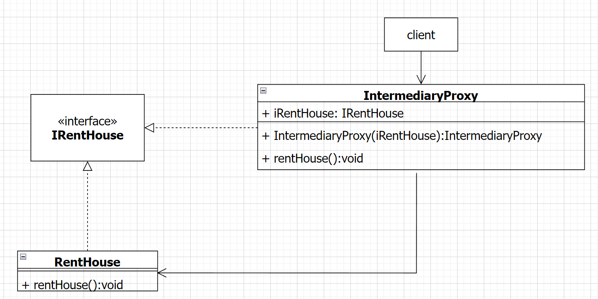

# 设计模式

## 设计模式六大原则

?>设计模式六大原则：1、单一原则；2、里氏替换原则；3、依赖倒置原则；4、接口隔离原则；5、迪米特原则；6、开闭原则。

`单一职责原则(single Responsibility Principle)`

> 对于类来说，一个类应该只负责一项职责，这就是单一职责原则，非常清晰。
>
> 单一职责原则的核心就是控制类的粒度大小、将对象解耦、提高其内聚性。
>
> 通常情况下， 我们应当遵守单一职责原则 。
>
> **原因主要分为如下3点：**
>
> 1）单一职责原则可以降低类的复杂度，一个类仅负责一项职责，其逻辑肯定要比负责多项职责简单；
>
> 2）提高了代码的可读性；
>
> 3）提高系统的可维护性。

------

`里氏代换原则(Liskov Substitution Principle)`

> **里氏代换原则**告诉我们，当使用继承时候，类 B 继承类 A 时，除添加新的方法完成新增功能外，尽量不要修改父类方法预期的行为。
>
> **里氏代换原则**的重点在不影响原功能，而不是不覆盖原方法。
>
> **子类尽量不要重写父类的方法，这就是里氏替换原则的核心精髓。**

------

`依赖倒置原则(Dependence Inversion Principle)`

> 由于在软件设计中细节具有多变性，而抽象层则相对稳定，因此以抽象为基础搭建起来的架构要比以细节为基础搭建起来的架构要稳定得多。
>
> 备注：这里的抽象指的是接口或者抽象类，而细节是指具体的实现类。
>
> <p>所以，依赖倒置原则的核心就是要<strong>我们面向接口或者抽象编程</strong>，而不是面向细节编程(实现类编程)，这样程序可维护性高很多啊。</p>
>
> <p><strong>依赖倒置原则主要就是2点：</strong></p>
>
> 1）高层模块不应该依赖底层模块，二者都应该依赖其抽象；
>
> 2）抽象不应该依赖细节，细节应该依赖抽象。

------

`接口隔离原则`

> <p>接口隔离原则要求程序员尽量将臃肿庞大的接口拆分成更小的和更具体的接口，让接口中只包含客户感兴趣的方法。</p>
>
> <p>客户端不应该依赖它不需要的接 口，即一个类对另一个类的依赖，应该建立在最小的接口上。</p>
>
> <p>接口隔离原则和单一职责都是为了提高类的内聚性、降低它们之间的耦合性，体现了封装的思想。</p>
>
> <p>但两者是不同的，主要就是2点：</p>
>
> 1）单一职责原则主要是约束类，它针对的是程序中的实现和细节；
>
> 2）接口隔离原则主要约束接口，主要针对抽象和程序整体框架的构建。

------

`开闭原则`

> <p>开闭原则是编程中最基础、最重要的设计原则。</p>
>
> <p>比如：软件中的对象（类、模块、函数等）应该对于扩展是开放的，对于修改是封闭的。</p>
>
> <p>当软件需要变化时，尽量 通过扩展 软件实体的行为来实现变化，而 不是通过修改 已 有的代码来实现变化，这就是开闭原则的核心精髓。</p>

------

`迪米特法则`

> <p>迪米特法则，就是一个对象应该对其他对象保持最少的了解，又叫最少知道原则，即一个类对自己依赖的类知道越少越好。</p>
>
> <p>迪米特法则在于降低类之间的耦合，每个类尽量减少对其他类的依赖，尽量减少对外暴露的方法，使得功能模块独立且低耦合。</p>

------

## 常用设计模式

### 单例模式

?>`Spring中bean的默认作用域就是singleton`

<!-- tabs:start -->

#### **饿汉式**

```java
/**
 * @Author: MMDZ
 * @Desc: TODO 饿汉式
 * 提前把对象new出来，第一次获取这个类对象的时候直接就存在这个类了，省去了创建类这一步的开销
 */
public class Singleton1 {
    // 创建一个实例对象
    private static Singleton1 instance = new Singleton1();
    // 私有构造方法，防止被实例化
    private Singleton1(){}
    // 静态get方法
    private static Singleton1 getInstance(){
        return instance;
    }
}
```

#### **懒汉式(线程不安全)**

```java
/**
 * @Author: MMDZ
 * @Desc: TODO 懒汉式
 * 需要的时候把对象new出来
 */
public class Singleton2 {
    // 定义一个对象
    private static Singleton2 instance;
    // 私有构造方法，防止被实例化
    private Singleton2(){}
    // 静态get方法
    private static Singleton2 getInstance(){
        return Objects.isNull(instance) ? instance = new Singleton2() : instance;
    }
}
```

#### **懒汉式(双检锁+volatile)⭐**

```java
/**
 * @Author: MMDZ
 * @Desc: TODO 懒汉式 双检锁做两次判断
 */
public class Singleton3 {
    // 定义一个对象
    private volatile static Singleton3 instance = null;
    // 私有构造方法，防止被实例化
    private Singleton3() {}
    // 静态get方法
    private static Singleton3 getInstance() {
        // 先检查实例是否存在，如果不存在才进入下面的同步块
        if (Objects.isNull(instance)) {
            // 同步块，线程安全的创建实例
            synchronized (Singleton3.class) {
                // 再次检查实例是否存在，如果不存在才真正的创建实例
                if (Objects.isNull(instance)) {
                    instance = new Singleton3();
                }
            }
        }
        return instance;
    }
}
```

#### **内部类**

```java
/**
 * @Author: MMDZ
 * @Desc: TODO 静态内部类
 */
public class Singleton4 {
    /* 私有构造方法，防止被实例化 */
    private Singleton4() {}

    /* 此处使用一个内部类来维护单例 */
    private static class SingletonFactory {
        private static Singleton4 instance = new Singleton4();
    }

    /* 获取实例 */
    public static Singleton4 getInstance() {
        return SingletonFactory.instance;
    }
}
```

#### **枚举**

```java
/**
 * @Author: MMDZ
 * @Desc: TODO 枚举
 */
public enum Singleton5 {
    INSTANCE;
    public Singleton5 getInstance(){
        return INSTANCE;
    }
}
```

<!-- tabs:end -->

### 代理模式

> Spring AOP就是基于动态代理的，如果要代理的对象，实现了某个接口，那么Spring AOP会使用JDK Proxy，去创建代理对象，而对于没有实现接口的对象，就无法使用JDK Proxy去进行代理了，这时候Spring AOP会使用Cglib，这时候Spring AOP会使用Cglib生成一个被代理对象的子类来作为代理。

<!-- tabs:start -->

#### **静态代理**

以租房为例，租客找房东租房，然后中间经过房屋中介，以此为背景，它的UML图如下：



```java
/**
 * @author MMDZ
 * @description TODO 房东
 */
public interface IRentHouse {
  void rentHouse(); // 租房
}

/**
 * @author MMDZ
 * @description TODO 租房
 */
public class RentHouse implements IRentHouse {
  @Override
  public void rentHouse() {
    System.out.println("实现租房");
  }
}

/**
 * @author MMDZ
 * @description TODO 中介
 */
public class IntermediaryProxy implements IRentHouse {
  private IRentHouse iRent;
  public IntermediaryProxy(IRentHouse iRentHouse) {
    iRent=iRentHouse;
  }
  @Override
  public void rentHouse() {
    System.out.println("交中介费");
    iRent.rentHouse();
    System.out.println("中介负责维修管理");
  }
}

/**
 * @author MMDZ
 * @description TODO 测试
 */
public class TestStaticProxy {
  public static void main(String[] args) {
    //定义租房
    IRentHouse iRentHouse = new RentHouse();
    //定义中介
    IRentHouse intermediaryProxy = new IntermediaryProxy(iRentHouse);
    //中介租房
    intermediaryProxy.rentHouse();
  }
}
```


#### **jdk动态代理（接口代理）**

Jdk代理涉及到java.lang.reflect包中的InvocationHandler接口和Proxy类，核心方法是

```java
public Object invoke(Object proxy, Method method, Object[] args) throws Throwable 
```

jdk动态代理过程中实际上代理的是接口，是因为在创建代理实例的时候，依赖的是java.lang.reflect包中Proxy类的newProxyInstance方法，该方法的生效就恰恰需要这个参数；

```java
public static Object newProxyInstance(ClassLoader loader,
                                       Class<?>[] interfaces,
                                       InvocationHandler h)
     throws IllegalArgumentException{
     ……
     }
```

`实现`

```java
/**
 * @author mmdz
 * @dec TODO
 */
public interface Person {
    void sleep();
}

/**
 * @author mmdz
 * @dec TODO
 */
public class Student implements Person {
    private String name;
    public Student() {
    }
    public Student(String name) {
        this.name = name;
    }
    public void sleep() {
        System.out.println("学生" + name + "晚上睡觉啦");
    }
}

/**
 * @author mmdz
 * @dec TODO 代理
 */
public class JDKDynamicProxy {
    private Object target;
    public JDKDynamicProxy(Object target) {
        this.target = target;
    }
    public Person getProxy() {
        Person person = null;
        ClassLoader classLoader = target.getClass().getClassLoader();
        Class<?>[] interfaces = target.getClass().getInterfaces();
        InvocationHandler handler = (proxy, method, args) -> {
                String methodName = method.getName();
                System.out.println("开启日志追踪：the method "+methodName);
                Object o = method.invoke(target, args);
                System.out.println("结束日志追踪：the method "+methodName+" end with "+o );
                return o;
        };
        person = (Person) Proxy.newProxyInstance(classLoader, interfaces, handler);
        return person;
    }
}

/**
 * @author mmdz
 * @dec TODO 测试
 */
public class TestJDKDynamicProxy {
    public static void main(String[] args) {
        JDKDynamicProxy proxy = new JDKDynamicProxy(new Student("zhangsan"));
        Person person = proxy.getProxy();
        person.sleep();
    }
}
```

#### **cglib动态代理**

```java
/**
 * @author mmdz
 * @dec TODO
 */
public interface Person {
    void sleep();
}

/**
 * @author mmdz
 * @dec TODO
 */
public class Student implements Person {
    private String name;
    public Student() {
    }
    public Student(String name) {
        this.name = name;
    }
    public void sleep() {
        System.out.println("学生" + name + "晚上睡觉啦");
    }
}

/**
 * @author mmdz
 * @dec TODO 代理
 */
public class CglibProxy implements MethodInterceptor {
    //在内存中构建一个子类对象从而实现对目标对象功能扩展
    private Enhancer enhancer= new Enhancer();
    private Object target;

    public CglibProxy(Object target) {
        this.target = target;
    }
    public Object getProxy(){
        //设置需要创建子类的类
        enhancer.setSuperclass(target.getClass());
        //设置回调函数
        enhancer.setCallback(this);
        //通过字节码技术动态创建子类实例
        return enhancer.create();
    }
    @Override
    public Object intercept(Object o, Method method, Object[] args, MethodProxy methodProxy) throws Throwable {
        long l1 = System.currentTimeMillis();
        //method 当前正在作用在哪一个方法之上  methodName方法名
        String methodName = method.getName();
        //日志追踪
        System.out.println("开启日志追踪：the method "+methodName+" begin with "+ Arrays.asList(args));

        //利用反射执行目标方法  invoke(执行哪一个对象的方法 , 方法所需要的形参)
        //返回方法的执行结果  若目标方法没有返回值则返回null
        Object result = method.invoke(target, args);

        //计算耗时
        long l2 = System.currentTimeMillis();
        System.out.println("结束日志追踪：the method "+methodName+" end with "+result +" , 此方法耗时："+(l2-l1)/1000.0+"s" );
        return result;
    }
}

/**
 * @author mmdz
 * @dec TODO
 */
public class TestCglibProxy {
    public static void main(String[] args) {
        CglibProxy proxy = new CglibProxy(new Student("zhangsan"));
        //通过生成子类的方式创建代理类
        Student student = (Student) proxy.getProxy();
        student.sleep();
    }
}
```

<!-- tabs:end -->

### 模板方法设计模式

### 观察者设计模式

### 适配器设计模式

### 装饰者设计模式

### 策略设计模式

### 责任链模式
