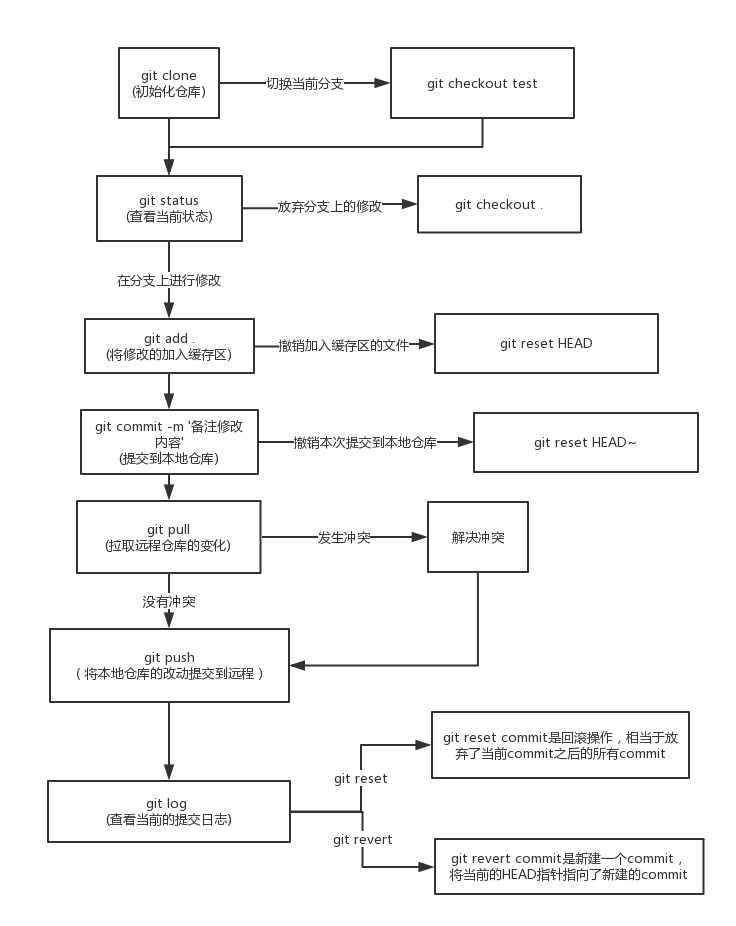

# Git

### Git 的三种状态

> Git 有三种状态，你的文件可能处于其中之一：
>
> 1. **已提交（committed）**：数据已经安全的保存在本地数据库中。
> 2. **已修改（modified）**：已修改表示修改了文件，但还没保存到数据库中。
> 3. **已暂存（staged）**：表示对一个已修改文件的当前版本做了标记，使之包含在下次提交的快照中。
>
> 由此引入 Git 项目的三个工作区域的概念：**Git 仓库(.git directory)**、**工作目录(Working Directory)** 以及 **暂存区域(Staging Area)** 。
>
> 

### 基本的 Git 工作流程如下

> 1. 在工作目录中修改文件。
> 2. 暂存文件，将文件的快照放入暂存区域。
> 3. 提交更新，找到暂存区域的文件，将快照永久性存储到 Git 仓库目录。

### 常用操作和命令

> `工作流程下，每步操作对应的命令：`
>
> 1. 初始化仓库（或者检出仓库）
>
>    **git clone（git checkout test）**
>
> 2. 查看当前状态
>
>    **git status**
>
> 3. 将工作目录中修改的文件加入缓冲区（撤销加入缓冲区的文件）
>    git add（git reset filename）
>
> 4. 修改备注内容，提交到本地仓库
>
>    **git commit -m '备注'**
>
> 5. 拉取远程仓库（有冲突解决冲突）
>
>    git pull
>
> 6. 将本地仓库的改动提交到远程
>
>    **git push**
>
> 7. 查看当前的提交日志
>
>    **git log**
>
> 
