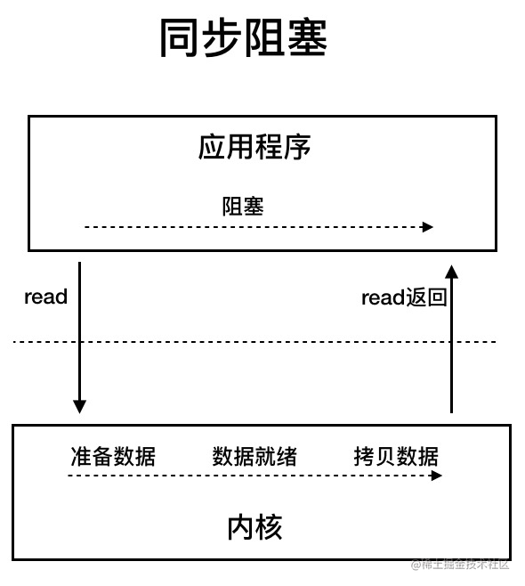
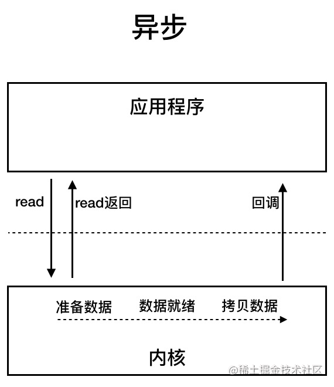

# Java IO模型详解

### I/O是什么（IO概念）

> IO指的就是读入/写出数据的过程，和**等待**读入/写出数据的过程。一旦拿到数据后就变成了数据操作了，就不是IO了。
>
> 拿网络IO来说，等待的过程就是数据从网络到网卡再到内核空间。读写的过程就是内核空间和用户空间的相互拷贝。
>
> 所以IO就包括两个过程，一个是等待数据的过程，一个是读写（拷贝）数据的过程。而且还要明白，一定**不**能包括操作数据的过程。

## IO流

项目常用来读取文件配置/文件资源，Excel 导入导出等

- InputStream/Reader: 所有的输入流的基类，前者是字节输入流，后者是字符输入流。
- OutputStream/Writer: 所有输出流的基类，前者是字节输出流，后者是字符输出流。

### 有哪些常见的 IO 模型?

> - 同步阻塞 IO ⭐
> - 同步非阻塞 IO
> - IO 多路复用 ⭐
> - 信号驱动 IO
> - 异步 IO ⭐

## Java 中 3 种常见 IO 模型

### BIO (Blocking I/O)

> **BIO 属于同步阻塞 IO 模型** 。
>
> **同步阻塞 IO 模型中，应用程序发出一个 read 调用，内核空间需要经历准备数据的几个阶段，准备好之后返回数据给应用程序。期间如果另一个应用程序也需要 read 调用，那么它必须等待；这就是阻塞。**
>
> BIO 最大的**特点**就是一次只能处理一个调用，这在高并发的场景下肯定是不行的。
>
> 举例：老师收作业，第一个作业没写完就一直阻塞



### NIO (Non-blocking/New I/O)

> Java 中的 NIO 于 Java 1.4 中引入，对应 `java.nio` 包，提供了 `Channel` , `Selector`，`Buffer` 等抽象。其中有一个非常重要的选择器 ( Selector ) 的概念，也可以被称为 多路复用器。通过它，只需要一个线程（单线程）便可以管理多个客户端连接。只有当客户端数据到了之后，才会为其服务。
>
> Java 中的 NIO 可以看作是 I/O 多路复用模型。也有很多人认为，Java 中的 NIO 属于同步非阻塞 IO 模型。
>
> - **同步非阻塞 IO**
>
>   `描述：`同步非阻塞 IO 模型中，应用程序会一直发起 read 调用，等待数据从内核空间拷贝到用户空间的这段时间里，线程依然是阻塞的，直到在内核把数据拷贝到用户空间。
>
>   `举例：`语文老师、数学老师、英语老师收作业，每个人反复询问，有没有写完作业，写完了就收作业
>
>   相比于同步阻塞 IO 模型，同步非阻塞 IO 模型确实有了很大改进。通过轮询操作，避免了一直阻塞。
>
>   但是，这种 IO 模型同样存在问题：**应用程序不断进行 I/O 系统调用轮询数据是否已经准备好的过程是十分消耗 CPU 资源的。**
>
>   
>
> - **多路复用 IO**
>
>   `描述：`IO 多路复用模型中，线程首先发起 select 调用，询问内核数据是否准备就绪，等内核把数据准备好了，用户线程再发起 read 调用。read 调用的过程（数据从内核空间 -> 用户空间）还是阻塞的。
>
>   这里 `Selector` 选择器的作用是监听多个通道的状态，判断是否空闲。
>
>   `举例：`语文老师、数学老师、英语老师收作业，A的英语作业写好了，英语老师就去收A的作业就好了
>
>   `特点：`**IO 多路复用模型，通过减少无效的系统调用，减少了对 CPU 资源的消耗。**
>
>   目前支持 IO 多路复用的系统调用，有 select，epoll 等等。select 系统调用，目前几乎在所有的操作系统上都有支持。
>
>   

### AIO (Asynchronous I/O)

> AIO 也就是 NIO 2。Java 7 中引入了 NIO 的改进版 NIO 2,它是异步 IO 模型。
>
> 异步 IO 是基于事件和回调机制实现的，也就是应用操作之后会直接返回，不会堵塞在那里，当后台处理完成，操作系统会通知相应的线程进行后续的操作。
>
> 目前来说 AIO 的应用还不是很广泛。Netty 之前也尝试使用过 AIO，不过又放弃了。这是因为，Netty 使用了 AIO 之后，在 Linux 系统上的性能并没有多少提升。
>
> 

## Reactor 模型

### 单线程的 Reactor 模型


### 多线程的 Reactor 模型


### 多线程主从 Reactor 模型


##  


## Java io代码示例

<!-- tabs:start -->

#### **BIO**

客户端：

```java
public class IOClient {
  public static void main(String[] args) {
    // 创建多个线程，模拟多个客户端连接服务端
    new Thread(() -> {
      try {
        Socket socket = new Socket("127.0.0.1", 3333);
        while (true) {
          try {
            socket.getOutputStream().write((new Date() + ": hello world").getBytes());
            Thread.sleep(2000);
          } catch (Exception e) {
          }
        }
      } catch (IOException e) {
      }
    }).start();
  }
}
```

服务端：

```java
public class IOServer {

  public static void main(String[] args) throws IOException {
    // TODO 服务端处理客户端连接请求
    ServerSocket serverSocket = new ServerSocket(3333);

    // 接收到客户端连接请求之后为每个客户端创建一个新的线程进行链路处理
    new Thread(() -> {
      while (true) {
        try {
          // 阻塞方法获取新的连接
          Socket socket = serverSocket.accept();
          
          // 每一个新的连接都创建一个线程，负责读取数据
          new Thread(() -> {
            try {
              int len;
              byte[] data = new byte[1024];
              InputStream inputStream = socket.getInputStream();
              // 按字节流方式读取数据
              while ((len = inputStream.read(data)) != -1) {
                System.out.println(new String(data, 0, len));
              }
            } catch (IOException e) {
            }
          }).start();
        } catch (IOException e) {
        }
      }
    }).start();
  }
}
```

#### **NIO**

客户端：

```java
public class IOClient {

  public static void main(String[] args) {
    // 创建多个线程，模拟多个客户端连接服务端
    new Thread(() -> {
      try {
        Socket socket = new Socket("127.0.0.1", 3333);
        while (true) {
          try {
            socket.getOutputStream().write((new Date() + ": hello world").getBytes());
            Thread.sleep(2000);
          } catch (Exception e) {
          }
        }
      } catch (IOException e) {
      }
    }).start();
  }
}
```

服务端：

```java
public class NIOServer {
  public static void main(String[] args) throws IOException {
    // 1. serverSelector负责轮询是否有新的连接，服务端监测到新的连接之后，不再创建一个新的线程，
    // 而是直接将新连接绑定到clientSelector上，这样就不用 IO 模型中 1w 个 while 循环在死等
    Selector serverSelector = Selector.open();
    // 2. clientSelector负责轮询连接是否有数据可读
    Selector clientSelector = Selector.open();

    new Thread(() -> {
      try {
        // 对应IO编程中服务端启动
        ServerSocketChannel listenerChannel = ServerSocketChannel.open();
        listenerChannel.socket().bind(new InetSocketAddress(3333));
        listenerChannel.configureBlocking(false);
        listenerChannel.register(serverSelector, SelectionKey.OP_ACCEPT);

        while (true) {
          // 监测是否有新的连接，这里的1指的是阻塞的时间为 1ms
          if (serverSelector.select(1) > 0) {
            Set<SelectionKey> set = serverSelector.selectedKeys();
            Iterator<SelectionKey> keyIterator = set.iterator();

            while (keyIterator.hasNext()) {
              SelectionKey key = keyIterator.next();

              if (key.isAcceptable()) {
                try {
                  // (1) 每来一个新连接，不需要创建一个线程，而是直接注册到clientSelector
                  SocketChannel clientChannel = ((ServerSocketChannel) key.channel()).accept();
                  clientChannel.configureBlocking(false);
                  clientChannel.register(clientSelector, SelectionKey.OP_READ);
                } finally {
                  keyIterator.remove();
                }
              }
            }
          }
        }
      } catch (IOException ignored) {
      }
    }).start();
    new Thread(() -> {
      try {
        while (true) {
          // (2) 批量轮询是否有哪些连接有数据可读，这里的1指的是阻塞的时间为 1ms
          if (clientSelector.select(1) > 0) {
            Set<SelectionKey> set = clientSelector.selectedKeys();
            Iterator<SelectionKey> keyIterator = set.iterator();

            while (keyIterator.hasNext()) {
              SelectionKey key = keyIterator.next();

              if (key.isReadable()) {
                try {
                  SocketChannel clientChannel = (SocketChannel) key.channel();
                  ByteBuffer byteBuffer = ByteBuffer.allocate(1024);
                  // (3) 面向 Buffer
                  clientChannel.read(byteBuffer);
                  byteBuffer.flip();
                  System.out.println(
                      Charset.defaultCharset().newDecoder().decode(byteBuffer).toString());
                } finally {
                  keyIterator.remove();
                  key.interestOps(SelectionKey.OP_READ);
                }
              }
            }
          }
        }
      } catch (IOException ignored) {
      }
    }).start();
  }
}
```

<!-- tabs:end -->

