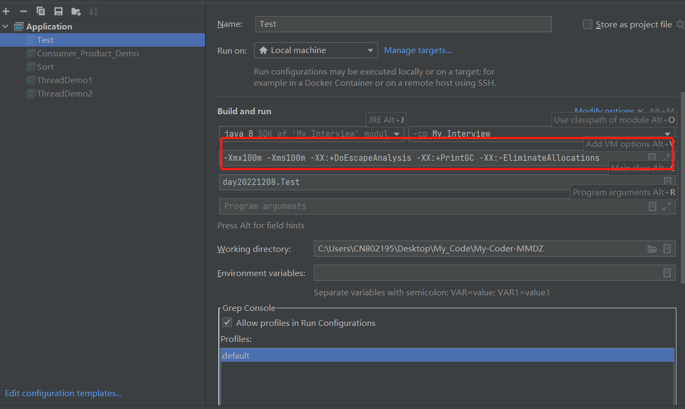
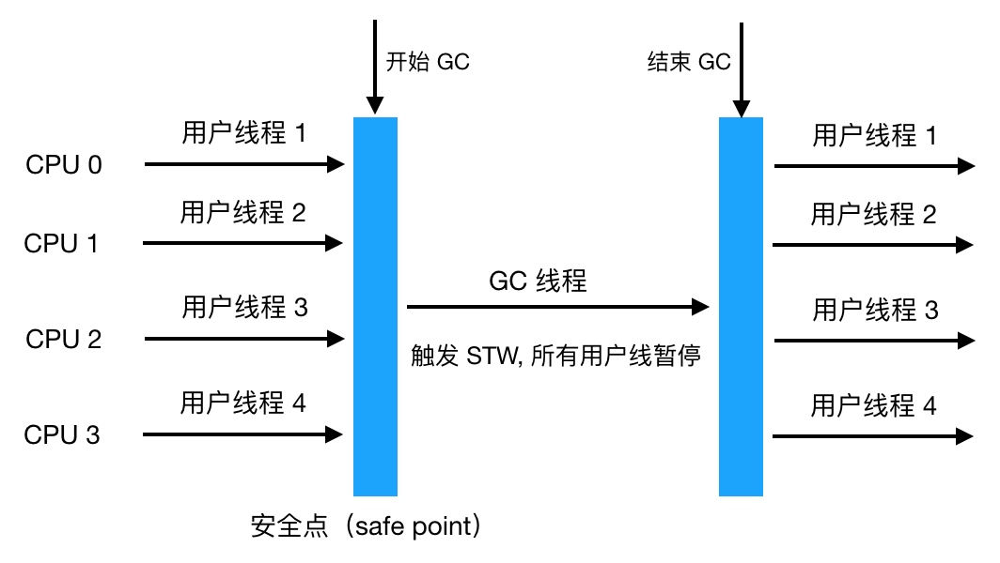
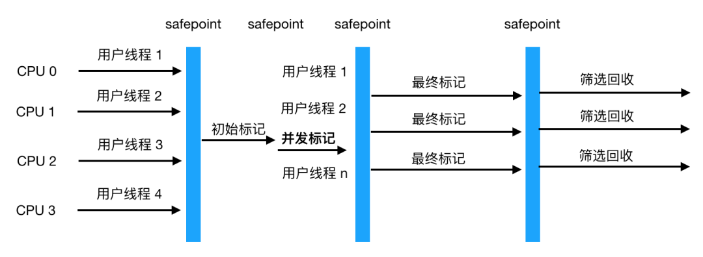

# JVM面试篇

## 1.类加载过程详解

### 类的生命周期

> 一个类的完整生命周期如下：
>
> 

### 类加载过程

> `什么是类的加载过程?`
>
> 一个Java文件从编码完成到最终运行，一般会经历两个阶段：编译期、运行期。编译，即通过javac命令，将Java文件转化为二进制字节码文件，即.class文件；运行，则是将.class文件交给JVM执行。而本文所说的类加载过程就是将.class文件中类的元信息加载进内存，创建Class对象并进行解析、初始化类变量等的过程
>
> `类加载详解`
>
> 系统加载 Class 类型的文件主要三步：**加载->连接->初始化**。连接过程又可分为三步：**验证->准备->解析**。
>
> 
>
> - `加载`
>
>   **类的加载主要的职责为将.class文件的二进制字节流读入内存**(JDK1.7及之前为JVM内存，JDK1.8及之后为本地内存)，并在堆内存中为之创建Class对象，作为.class进入内存后的数据的访问入口。在这里只是读入二进制字节流，后续的验证阶段就是要拿二进制字节流来验证.class文件，验证通过，才会将.class文件转为运行时数据结构
>          ++拓展： 在JDK1.7及以前，Hot Spot JVM(普遍在用的JVM)存在一块叫做方法区的内存，也称之为永久代，这块区域用于存放类的元数据信息，包括类的字段，版本，方法等，这块区域，可以理解为.class文件进入内存后的位置。在JDK1.8，取消了方法区，取而代之的是元数据区，该元数据区并非JVM内存，而是本地内存。此外在JDK1.7时，将常量池从方法区移除，在堆内存开辟了一块空间作为常量池，有人说这是为取消方法区做的准备
>
> - `连接`
>
>   - `验证`
>
>      **验证的过程只要是保证 class 文件的安全性和正确性**，确保加载了该 class 文件不会导致 JVM 出现任何异常，不会危害JVM 的自身安全。验证包括对文件格式的验证，元数据和字节码的验证。
>
>   - `准备`
>
>      **准备阶段的主要任务是为类的类变量开辟空间并赋默认值**。
>
>      - 静态变量是基本类型（int、long、short、char、byte、boolean、float、double）的默认值为0
>      - 静态变量是引用类型的，默认值为null
>      - 静态常量默认值为声明时设定的值
>
>   - `解析`
>
>      **该阶段的主要职责为将Class在常量池中的符号引用转变为直接引用**。
>
>      **符号引用**即字符串，说白了可以是一个字段名，或者一个方法名；**直接引用**即偏移量，说白了就是类的元信息位于内存的地址串，例如，一个类的方法为test()，则符号引用即为test，这个方法存在于内存中的地址假设为0x123456，则这个地址则为直接引用。
>
> - `初始化`
>
>    该阶段主要是为类的类变量初始化值的，初始化有两种方式：
>
>   - 在声明类变量时，直接给变量赋值
>   - 在静态初始化块为类变量赋值
>
>

------

## 2.类加载器详解

### 介绍一下类加载器

> 类加载器JVM 中内置了三个重要的 ClassLoader，除了 BootstrapClassLoader 其他类加载器均由 Java 实现且全部继承自`java.lang.ClassLoader`：
>
> 1. **BootstrapClassLoader(启动类加载器)** ：最顶层的加载类，由 C++实现，负责加载 `%JAVA_HOME%/lib`目录下的 jar 包和类或者被 `-Xbootclasspath`参数指定的路径中的所有类。
> 2. **ExtensionClassLoader(扩展类加载器)** ：主要负责加载 `%JRE_HOME%/lib/ext` 目录下的 jar 包和类，或被 `java.ext.dirs` 系统变量所指定的路径下的 jar 包。
> 3. **AppClassLoader(应用程序类加载器)** ：面向我们用户的加载器，负责加载当前应用 classpath 下的所有 jar 包和类。

### 双亲委派模型介绍

> 每一个类都有一个对应它的类加载器。系统中的 ClassLoader 在协同工作的时候会默认使用 **双亲委派模型** 。即在类加载的时候，系统会首先判断当前类是否被加载过。已经被加载的类会直接返回，否则才会尝试加载。加载的时候，首先会把该请求委派给父类加载器的 `loadClass()` 处理，因此所有的请求最终都应该传送到顶层的启动类加载器 `BootstrapClassLoader` 中。当父类加载器无法处理时，才由自己来处理。当父类加载器为 null 时，会使用启动类加载器 `BootstrapClassLoader` 作为父类加载器。
>
> 

### 双亲委派模型的好处

> 双亲委派模型保证了 Java 程序的稳定运行，可以避免类的重复加载（JVM 区分不同类的方式不仅仅根据类名，相同的类文件被不同的类加载器加载产生的是两个不同的类），也保证了 Java 的核心 API 不被篡改。如果没有使用双亲委派模型，而是每个类加载器加载自己的话就会出现一些问题，比如我们编写一个称为 `java.lang.Object` 类的话，那么程序运行的时候，系统就会出现多个不同的 `Object` 类。

### 如果我们不想用双亲委派模型怎么办

> **自定义加载器**的话，需要继承 `ClassLoader` 。如果我们不想打破双亲委派模型，就重写 `ClassLoader` 类中的 `findClass()` 方法即可，无法被父类加载器加载的类最终会通过这个方法被加载。但是，如果想打破双亲委派模型则需要重写 `loadClass()` 方法

### 那你知道有哪个场景破坏了双亲委派机制吗？

> **候选者**：最明显的就Tomcat啊
>
> **面试官**：详细说说？
>
> **候选者**：在初学时部署项目，我们是把war包放到tomcat的webapp下，这意味着一个tomcat可以运行多个Web应用程序
>
> **候选者**：是吧？
>
> **面试官**：嗯..
>
> **候选者**：那假设我现在有两个Web应用程序，它们都有一个类，叫做User，并且它们的类全限定名都一样，比如都是com.yyy.User。但是他们的具体实现是不一样的
>
> **候选者**：那么Tomcat是如何保证它们是不会冲突的呢？
>
> **候选者**：答案就是，Tomcat给每个 Web 应用创建一个类加载器实例（WebAppClassLoader），该加载器重写了loadClass方法，优先加载当前应用目录下的类，如果当前找不到了，才一层一层往上找
>
> **候选者**：那这样就做到了Web应用层级的隔离
>
> 

------

## 3.Java 内存区域详解

### JDK 1.8 和之前的版本区别？

> JDK1.8和JDK1.7的jvm内存最大的区别是, 在1.8中方法区是由元空间(元数据区)来实现的，常量池移到堆中。
>
> 1.8不存在方法区，将方法区的实现给去掉了，而是在本地内存中，新加入元数据区(元空间).
>
> 元空间: 存储.class 信息, 类的信息,方法的定义,静态变量等。
>
> 而常量池放到堆里存储

`JDK 1.8 之前`


`JDK 1.8 之后`


### 为什么要将永久代 (PermGen) 替换为元空间 (MetaSpace) 呢?

> 1. 整个永久代有一个 JVM 本身设置的固定大小上限，无法进行调整，而元空间使用的是直接内存，受本机可用内存的限制，虽然元空间仍旧可能溢出，但是比原来出现的几率会更小。
> 2. 元空间里面存放的是类的元数据，这样加载多少类的元数据就不由 `MaxPermSize` 控制了, 而由系统的实际可用空间来控制，这样能加载的类就更多了。
> 3. 在 JDK8，合并 HotSpot 和 JRockit 的代码时, JRockit 从来没有一个叫永久代的东西, 合并之后就没有必要额外的设置这么一个永久代的地方了。

### 介绍下 Java 内存区域（运行时数据区）？

> **线程私有的：** 程序计数器、虚拟机栈、本地方法栈
>
> **线程共享的：** 堆、方法区、直接内存 (非运行时数据区的一部分)

<!-- tabs:start -->

#### **程序计数器**

> `程序计数器：`
>
> 程序计数器是一块较小的内存空间，可以看作是当前线程所执行的字节码的行号指示器。
>
> `主要有两个作用：`
>
> - 字节码解释器通过改变程序计数器来依次读取指令，从而实现代码的流程控制，如：顺序执行、选择、循环、异常处理。
> - 在多线程的情况下，程序计数器用于记录当前线程执行的位置，从而当线程被切换回来的时候能够知道该线程上次运行到哪儿了。
>
> ⚠️ 注意 ：程序计数器是唯一一个不会出现 `OutOfMemoryError` 的内存区域，它的生命周期随着线程的创建而创建，随着线程的结束而死亡。

#### **Java 虚拟机栈**

> `Java 虚拟机栈：`
>
> Java 虚拟机栈也是线程私有的，它的**生命周期**和线程相同，随着线程的创建而创建，随着线程的死亡而死亡。
>
> 除了一些 Native 方法调用是通过本地方法栈实现的(后面会提到)，**其他所有的 Java 方法调用**都是通过栈来实现的（也需要和其他运行时数据区域比如程序计数器配合）。
>
> 方法调用的数据需要通过栈进行传递，每一次方法调用都会有一个对应的栈帧被压入栈中，每一个方法调用结束后，都会有一个栈帧被弹出。
>
> **栈由一个个栈帧组成，而每个栈帧中都拥有：局部变量表、操作数栈、动态链接、方法返回地址。**和数据结构上的栈类似，两者都是先进后出的数据结构，只支持出栈和入栈两种操作。
>
> 
>
> ------
>
> - **局部变量表** 主要存放了编译期可知的各种数据类型（boolean、byte、char、short、int、float、long、double）、对象引用（reference 类型，它不同于对象本身，可能是一个指向对象起始地址的引用指针，也可能是指向一个代表对象的句柄或其他与此对象相关的位置）。
>
> - **操作数栈** 主要作为方法调用的中转站使用，用于存放方法执行过程中产生的中间计算结果。另外，计算过程中产生的临时变量也会放在操作数栈中。
>
> - **动态链接** 主要服务一个方法需要调用其他方法的场景。在 Java 源文件被编译成字节码文件时，所有的变量和方法引用都作为符号引用（Symbilic Reference）保存在 Class 文件的常量池里。当一个方法要调用其他方法，需要将常量池中指向方法的符号引用转化为其在内存地址中的直接引用。动态链接的作用就是为了将符号引用转换为调用方法的直接引用。
>
>   
>
> - Java 方法有两种返回方式，一种是 return 语句正常返回，一种是抛出异常。不管哪种返回方式，都会导致栈帧被弹出。也就是说， **栈帧随着方法调用而创建，随着方法结束而销毁。无论方法正常完成还是异常完成都算作方法结束。**
>
> ------
>
> `简单总结一下程序运行中栈可能会出现两种错误：`
>
> - **`StackOverFlowError`：** 若栈的内存大小不允许动态扩展，那么当线程请求栈的深度超过当前 Java 虚拟机栈的最大深度的时候，就抛出 `StackOverFlowError` 错误。
> - **`OutOfMemoryError`：** 如果栈的内存大小可以动态扩展， 如果虚拟机在动态扩展栈时无法申请到足够的内存空间，则抛出`OutOfMemoryError`异常。

#### **本地方法栈**

> 和虚拟机栈所发挥的作用非常相似，区别是： **虚拟机栈为虚拟机执行 Java 方法 （也就是字节码）服务，而本地方法栈则为虚拟机使用到的 Native 方法服务。** 在 HotSpot 虚拟机中和 Java 虚拟机栈合二为一。
>
> 本地方法被执行的时候，在本地方法栈也会创建一个栈帧，用于存放该本地方法的局部变量表、操作数栈、动态链接、出口信息。
>
> 方法执行完毕后相应的栈帧也会出栈并释放内存空间，也会出现 `StackOverFlowError` 和 `OutOfMemoryError` 两种错误。

#### **堆**

> Java 虚拟机所管理的内存中最大的一块，Java 堆是所有线程共享的一块内存区域，在虚拟机启动时创建。**此内存区域的唯一目的就是存放对象实例，几乎所有的对象实例以及数组都在这里分配内存。**
>
> 从 JDK 1.7 开始已经默认开启**逃逸分析**，如果某些方法中的对象引用没有被返回或者未被外面使用（也就是未逃逸出去），那么对象可以直接在栈上分配内存。
>
> **Java 堆是垃圾收集器管理的主要区域**，因此也被称作 **GC 堆（Garbage Collected Heap）**。
>
> ⚠️ 注意 ：堆这里最容易出现的就是 `OutOfMemoryError` 错误，并且出现这种错误之后的表现形式还会有几种，比如：
>
> 1. **`java.lang.OutOfMemoryError: GC Overhead Limit Exceeded`** ： 当 JVM 花太多时间执行垃圾回收并且只能回收很少的堆空间时，就会发生此错误。
> 2. **`java.lang.OutOfMemoryError: Java heap space`** :假如在创建新的对象时, 堆内存中的空间不足以存放新创建的对象, 就会引发此错误。(和配置的最大堆内存有关，且受制于物理内存大小。最大堆内存可通过`-Xmx`参数配置，若没有特别配置，将会使用默认值，详见：[Default Java 8 max heap sizeopen in new window](https://stackoverflow.com/questions/28272923/default-xmxsize-in-java-8-max-heap-size))

#### **方法区**

> `方法区`
>
> 方法区属于是 JVM 运行时数据区域的一块逻辑区域，是各个线程共享的内存区域
>
> 当虚拟机要使用一个类时，它需要读取并解析 Class 文件获取相关信息，再将信息存入到方法区。方法区会存储已被虚拟机加载的 **类信息、字段信息、方法信息、常量、静态变量、即时编译器编译后的代码缓存等数据**。

<!-- tabs:end -->

### Java对象的创建过程？

> `new 对象的时候过程`
>
> 
>
> 1. `类加载检查`
>
>    当虚拟机遇到new指令时，首先检查常量池中是否有这个参数的符号引用，是否加载，解析和初始化过，如果没有，则进行类加载的过程。如果已经加载，则为对象分配内存。
>
> 2. `分配内存`（**对象在Eden区分配**）
>
>    对象所需内存的大小在类加载完成后就可以确定了，所以说分配内存的过程就是把一块确定大小的内存块从堆中划分出来的过程。
>
>    **内存分配方式**有 **“指针碰撞”** 和 **“空闲列表”** 两种：
>
>    - **指针碰撞：**
>
>      - 原理 ：用过的内存全部整合到一边，没有用过的内存放在另一边，中间有一个分界指针，只需要向着没用过的内存方向将该指针移动对象内存大小位置即可。
>
>    - **空闲列表：**
>
>      - 原理 ：虚拟机会维护一个列表，该列表中会记录哪些内存块是可用的，在分配的时候，找一块儿足够大的内存块儿来划分给对象实例，最后更新列表记录。
>
>      **选择以上两种方式中的哪一种，取决于 Java 堆内存是否规整。而 Java 堆内存是否规整，取决于 GC 收集器的算法是"标记-清除"，还是"标记-整理"（也称作"标记-压缩"），值得注意的是，复制算法内存也是规整的。**
>
>    ------
>
>       **内存分配并发问题（补充内容，需要掌握）**
>
>       在创建对象的时候有一个很重要的问题，就是线程安全，因为在实际开发过程中，创建对象是很频繁的事情，作为虚拟机来说，必须要保证线程是安全的，通常来讲，虚拟机采用两种方式来保证线程安全：
>
>       - **CAS+失败重试**：
>
>         **虚拟机采用CAS配上失败重试的方式保证更新操作的原子性**来对分配内存空间的动作进行同步处理。也就是A，B同时使用一个指针分配内存，如果一个对象占用成功，那么另一个对象就去占用下一个内存块，直到成功分配内存为止。
>
>       - **TLAB（本地线程分配缓冲）**：
>
>         就是线程创建的时候，为每个线程在Java堆中**预先分配**一小块内存（这样就避免了多个线程间抢一块内存的问题），JVM 在给线程中的对象分配内存时，首先在 TLAB 分配，当对象大于 TLAB 中的剩余内存或 TLAB 的内存已用尽时，再采用上述的 CAS 进行内存分配。
>
> 3. `初始化`
>
>    **为对象的成员变量和静态变量赋初始值**，比如boolean类型的赋值为false，int类型赋值为0。这么做是为了保证对象实例的字段在Java代码中可以在不赋初值的情况下使用。程序可以访问到这些字段对用数据类型的默认值。
>
> 4. `设置对象头`
>
>    初始化零值完成之后，**虚拟机要对对象进行必要的设置**，例如这个对象是哪个类的实例、如何才能找到类的元数据信息、对象的哈希码、对象的 GC 分代年龄等信息。 **这些信息存放在对象头中。** 另外，根据虚拟机当前运行状态的不同，如是否启用偏向锁等，对象头会有不同的设置方式。
>
> 5. `执行init方法`
>
>    执行init方法，这步是为对象的成员变量和对象中的静态变量赋真正的值。第三步中是赋初始值，这一步是赋真正的值。

### Java对象结构(内存布局)

> 在 Hotspot 虚拟机中，对象在内存中的布局可以分为 3 块区域：**对象头**、**实例数据**和**对齐填充**。
>
> - `对象头`
>
>   Hotspot 虚拟机的对象头包括两部分信息
>
>   **markword** 用于存储对象自身的运行时数据**（哈希码、GC 分代年龄、锁状态标志等等）**
>
>   **class pointer（类型指针）**记录对象的类型信息；这一部分用于存储对象的类型指针，该指针指向它的类元数据，JVM通过这个指针确定对象是哪个类的实例。
>
> - `instance data(实例数据)`
>
>   **实例数据部分是对象真正存储的有效信息**，也是在程序中所定义的各种类型的字段内容
>
> - `padding（对齐填充）`
>
>   **对齐填充部分不是必然存在的，也没有什么特别的含义，仅仅起占位作用。** 因为 Hotspot 虚拟机的自动内存管理系统要求对象起始地址必须是 8 字节的整数倍，换句话说就是对象的大小必须是 8 字节的整数倍。因此，当对象实例数据部分没有对齐时，就需要通过对齐填充来补全。
>
> 
>
> !>⚠️ `注意` ：数组对象的内存分为五个部分
>
> 普通对象的内存分为四个部分：
>
> - markword(记录锁信息、GC信息、Hashcode共占8字节)
> - class pointer（类型指针，返回对象的类型信息；压缩4字节，未压缩8字节）
> - instance data(实例数据)
> - padding（对齐，对象大小不足8的整数倍，补齐到8的整数倍）
>
> 数组对象的内存分为五个部分：
>
> - markword(占8字节)
> - class pointer（类型指针，返回对象的类型信息；压缩4字节，未压缩8字节）
> - length(数组长度，最多4字节)
> - instance data(实例数据)
> - padding（对齐，对象大小不足8的整数倍，补齐到8的整数倍）

**查看对象字节数-案例**

> ```xml
> <dependency>
> <groupId>org.openjdk.jol</groupId>
> <artifactId>jol-core</artifactId>
> <version>0.10</version>
> </dependency>
> ```
>
> - ClassPointer指针：`-XX:+UseCompressedClassPointers` 为4字节 不开启为8字节
> - 实例数据 -> 引用类型：`-XX:+UseCompressedOops` 为4字节 不开启为8字节（Oops Ordinary Object Pointers）

### Java对象的定位方式(对象访问)

> 建立对象就是为了使用对象，我们的 Java 程序通过栈上的 reference 数据来操作堆上的具体对象。对象的访问方式由虚拟机实现而定，目前主流的访问方式有：**使用句柄**、**直接指针**。
>
> - `句柄访问`
>
>   如果使用句柄访问，在java堆中将划分出一块内存来作为句柄池。reference中存储的就是对象的句柄地址，而句柄中包含对象实例数据与类型数据具体地址信息。
>
>   优势：在对象被移动（GC中移动对象很常见）时只会改变句柄的实例数据指针，reference本身不需要修改
>
>   举例说明：
>
>   ```java
>   Object obj = new Object();
>   Object obj表示一个本地引用，存储在java栈的本地便变量表中，表示一个reference类型的数据。
>   new Object()作为实例对象存放在java堆中，同时java堆中还存储了Object类的信息（对象类型、实现接口、方法等）的具体地址信息，这些地址信息所执行的数据类型存储在方法区中。
>   ```
>
>   
>
> - `直接指针访问`
>
>   如果使用指针访问，那么java堆对象的布局中就必须考虑如何放置访问类型的相关信息（如对象的类型，实现的接口、方法、父类、field等），而reference中存储的就是对象的地址。
>
>   优势：速度快，节省了一次指针定位的时间开销，对象的访问在java中非常频繁，因此可以减少执行成本（Sun HotSpot虚拟机主要使用）
>
>   

### 对象怎么分配?(栈上-线程本地-Eden-Old)

> `Java中对象的分配过程`
>
> 1. 优先在栈中分配，对象不大，而且对象不会逃逸（对象只会在当前方法中引用）。随着方法调用结束弹栈，对象也就释放了。不需要GC！！！
>
> 2. 不满足栈上分配，看这个对象够不够大，够大直接进Old区，由FGC清除对象
>
> 3. 这个对象不够直接进Old区，优先分配在TLAB上（其实也是Eden区，JVM为了避免多线程并发分配内存空间进行抢占，提前在Eden区给每个线程单独分配一块内存区域）
>
> 4. 如果在TLAB上分配失败了，就会在Eden区进行分配。
>
>    

### 为什么对象栈上分配？

> 我们都知道，Java的对象都是在堆内存中存放，当对象没有被引用的时候，需要依靠GC进行回收内存，如果对象数量较多的时候，会给GC带来较大压力，也间接影响了应用的性能。为了减少临时对象在堆内分配的数量，JVM通过逃逸分析确定该对象不会被外部访问。如果不会逃逸可以将该对象在栈上分配内存。栈上分配依赖于`对象逃逸分析`和`标量替换`。

### 对象逃逸分析 和 标量替换

> `对象逃逸分析`
>
> - **什么是逃逸分析？**：
>
>   JVM通过逃逸分析**确定该对象不会被外部访问**。如果不会逃逸可以将该对象在栈上分配内存，这样该对象所占用的内存空间就可以随栈帧出栈而销毁，减轻GC的压力。
>
>   案例：
>
>   ```java
>   // doSomething1返回对象，在方法结束之后被返回了，那这个对象的作用域范围是不确定的。 
>   public User doSomething1() {
>      User user1 = new User ();
>      user1 .setId(1);
>      user1 .setDesc("artisan1");
>      // ......
>      return user1 ;
>   }
>   
>   // doSomething2方法可以非常确定的是当方法结束以后，user2这个对象就失效了，因为它的作用域范围是当前方法。 
>   // 那对于这样的对象，JVM会把这样的对象分配到线程栈中，让它随着方法结束时跟随线程栈内存一起被回收掉。
>   public void doSomething2() {
>      User user2 = new User ();
>      user2 .setId(2);
>      user2 .setDesc("artisan2");
>      // ...... 
>   }
>   ```
>
> - JDK7之后默认开启逃逸分析，如果要关闭使用参数(-XX:-DoEscapeAnalysis)
>
> `标量替换`
>
> 若一个数据已经无法再分解成更小数据来表示，JVM中基础数据类型都不能再进一步分解，这些数据可被称为标量。
>
> 假如逃逸分析能够证明一个对象不会被方法外部访问，并且该对象可被分解，那么程序真正执行时将可能不去创建该对象，而改为直接创建它的若干个被这方法使用的成员变量代替。
>
> 将对象拆分后，除可让对象的成员变量在栈上 （栈上存储的数据，很大机会被虚拟机分配至物理机器的高速寄存器中存储）分配和读写外，还可为后续进步优化创建条件。
>
> `做逃逸分析有什么好处`
>
> **这个简单来说就是把对象分解成一个个基本类型，并且内存分配不再是分配在堆上，而是分配在栈上。这样的好处有，一、减少内存使用，因为不用生成对象头。 二、程序内存回收效率高，并且GC频率也会减少，总的来说和上面优点一的效果差不多**。

`案例分析-标量替换`

> ```java
> public class ScalarReplace {
> public static void main(String[] args) {
>   long start = System.currentTimeMillis();
>   for (int i = 0; i < 10000000; i++) {
>       alloc();
>   }
>   long end = System.currentTimeMillis();
>   System.out.println("花费的时间为： " + (end - start) + " ms");
> }
> 
> static class Point {
>   private int x;
>   private int y;
> }
> 
> private static void alloc() {
>   Point point = new Point();
>   point.x = 1;
>   point.y = 2;
> }
> 
> /** 标量替换后的代码
> private static void alloc() {
>   int x = 1;
>   int y = 2;
> }
> */
> }
> ```
>
> ?>1亿次 alloc 调用进行对象创建，累计分配空间达到将近 1.5 GB。如果堆空间小于这个值，就必然会发生 GC
>
> 
>
> - 不进行标量替换
>
>   `环境参数设置：-Xmx100m -Xms100m -XX:+DoEscapeAnalysis -XX:+PrintGC -XX:-EliminateAllocations`
>
>   
>
> - 进行标量替换
>
>   `环境参数设置：-server -Xmx100m -Xms100m -XX:+DoEscapeAnalysis -XX:+PrintGC -XX:+EliminateAllocations`
>
>   
>
> **参数说明**
>
> - -server：启动Server模式，因为在server模式下，才可以启用逃逸分析。
> - -XX:+DoEscapeAnalysis：启用逃逸分析
> - -Xmx10m：指定了堆空间最大为10MB
> - -XX:+PrintGC：将打印Gc日志
> - -XX:+EliminateAllocations：开启了标量替换（默认打开），允许将对象打散分配在栈上，比如对象拥有 id 和 name 两个字段，那么这两个字段将会被视为两个独立的局部变量进行分配。

### Object o = new Object() 在内存中占用多少字节？

> 
>
> `-XX:+UseCompressedOops` 这个参数就是JVM提供给你的解决方案，可以压缩指针，将占用的空间压缩为原来的一半，起到节约空间的作用，classpointer参数大小就受到其影响。
>
> - **在开启指针压缩的情况下**，markword占用8字节，classpoint占用4字节，Instance data无数据，总共是12字节，由于对象需要为8的整数倍，Padding会补充4个字节，总共占用16字节的存储空间。
> - **在没有指针的情况下**，markword占用8字节，classpoint占用8字节，Instance data无数据，总共是16字节。

### Class对象是在堆还是在方法区？

> **Class对象是存放在堆区的**，不是方法区，这点很多人容易犯错。类的元数据（元数据并不是类的Class对象。Class对象是加载的最终产品，类的方法代码，变量名，方法名，访问权限，返回值等等都是在方法区的）才是存在方法区的。

------

## 4.JVM 垃圾回收详解⭐

### 如何识别垃圾

> 垃圾收集器在做垃圾回收的时候，首先需要判定的就是哪些内存是需要被回收的，哪些对象是「存活」的，是不可以被回收的；哪些对象已经「死掉」了，需要被回收。
>
> 一般有两种方法来判断：
>
> - **引用计数器法**：为每个对象创建一个引用计数，有对象引用时计数器 +1，引用被释放时计数 -1，当计数器为 0 时就可以被回收。它有一个缺点不能解决循环引用的问题；
>
>   所谓对象之间的相互引用问题，如下面代码所示：除了对象 `objA` 和 `objB` 相互引用着对方之外，这两个对象之间再无任何引用。但是他们因为互相引用对方，导致它们的引用计数器都不为 0，于是引用计数算法无法通知 GC 回收器回收他们。
>
>   ```java
>   public class ReferenceCountingGc {
>       Object instance = null;
>       public static void main(String[] args) {
>           ReferenceCountingGc objA = new ReferenceCountingGc();
>           ReferenceCountingGc objB = new ReferenceCountingGc();
>           objA.instance = objB;
>           objB.instance = objA;
>           objA = null;
>           objB = null;
>       }
>   }
>   ```
>
> - **可达性分析算法**：可达性分析算法是以根对象集合（GCRoots）为起始点，按照从上至下的方式搜索被根对象集合所连接的目标对象是否可达。
>
>   使用可达性分析算法后，内存中的存活对象都会被根对象集合直接或间接连接着，搜索所走过的路径称为引用链（Reference Chain）。
>
>   如果目标对象没有任何引用链相连，则是不可达的，就意味着该对象己经死亡，可以标记为垃圾对象。
>   
>   在可达性分析算法中，只有能够被根对象集合直接或者间接连接的对象才是存活对象。
>   
>   **哪些对象可以作为 GC Roots 呢？**
>
>   - 虚拟机栈(栈帧中的本地变量表)中引用的对象
>
>     比如：各个线程被调用的方法中使用到的参数、局部变量等。
>   
>   - 本地方法栈(Native 方法)中引用的对象
>   
>   - 方法区中类静态属性引用的对象
>   
>     比如：各个线程被调用的方法中使用到的参数、局部变量等。
>   
>   - 方法区中常量引用的对象
>   
>     比如：字符串常量池（string Table）里的引用
>   
>   - 所有被同步锁 synchronized 持有的对象
>   
>   - Java虚拟机内部的引用。
>   
>     基本数据类型对应的 Class 对象，一些常驻的异常对象（如：NullPointerException、OutOfMemoryError），系统类加载器。
>   
>   **对象可以被回收，就代表一定会被回收吗？**
>   
>   对象可回收，就一定会被回收吗?并不是，对象的 finalize 方法给了对象一次垂死挣扎的机会，当对象不可达（可回收）时，当发生GC时，会先判断对象是否执行了 finalize 方法，如果未执行，则会先执行 finalize 方法，我们可以在此方法里将当前对象与 GC Roots 关联，这样执行 finalize 方法之后，GC 会再次判断对象是否可达，如果不可达，则会被回收，如果可达，则不回收！

### 四种引用类型及其使用场景

**无论是通过引用计数法判断对象引用数量，还是通过可达性分析法判断对象的引用链是否可达，判定对象的存活都与“引用”有关。**

> 1. `强引用（StrongReference）`
>
>    Java中默认声明的就是强引用，比如：Object obj = new Object(); 
>
>    只要强引用存在，垃圾回收器将永远不会回收被引用的对象，哪怕内存不足时，JVM也会直接抛出OutOfMemoryError，不会去回收。如果想中断强引用与对象之间的联系，可以显示的将强引用赋值为null，这样一来，JVM就可以适时的回收对象了
>
> 2. `软引用（SoftReference）`
>
>    软引用是用来描述一些非必需但仍有用的对象。**在内存足够的时候，软引用对象不会被回收，只有在内存不足时，系统则会回收软引用对象，如果回收了软引用对象之后仍然没有足够的内存，才会抛出内存溢出异常**。这种特性常常被用来实现缓存技术，比如网页缓存，图片缓存等。
>
>    在 JDK1.2 之后，用java.lang.ref.SoftReference类来表示软引用。
>
> 3. `弱引用（WeakReference）`
>
>    弱引用的引用强度比软引用要更弱一些，**无论内存是否足够，只要 JVM 开始进行垃圾回收，那些被弱引用关联的对象都会被回收**。在 JDK1.2 之后，用 java.lang.ref.WeakReference 来表示弱引用。
>
>    应用场景：如果一个对象是偶尔的使用，并且希望在使用时随时就能获取到，但又不想影响此对象的垃圾收集，那么应该用 Weak Reference 来记住此对象。
>
> 4. `虚引用（PhantomReference）`    [*/*ˈfæntəm*/*]
>
>    虚引用是最弱的一种引用关系，如果一个对象仅持有虚引用，那么它就和没有任何引用一样，它随时可能会被回收，在 JDK1.2 之后，用 PhantomReference 类来表示。
>
>    虚引用的主要作用是跟踪对象被垃圾回收的状态。仅仅是提供了一种确保对象被finalize以后，做某些事情的机制。

### 如何判断一个常量是废弃常量

> 运行时常量池主要回收的是废弃的常量。那么，我们如何判断一个常量是废弃常量呢?
>
> 假如在常量池中存在字符串"abc" ,如果当前没有任何String对象引用该字符串常量的话，就说明常量"abc"就是废弃常量,如果这时发生内存回收的话而且有必要的话，" abc"就会被系统清理出常量池。

### 如何判断一个类是无用的类

> 1. 该类所有的实例都已经被回收，也就是 Java 堆中不存在该类的任何实例。
> 2. 加载该类的 ClassLoader 已经被回收。
> 3. 该类对应的 java.lang.Class 对象没有在任何地方被引用，无法在任何地方通过反射访问该类的方法。

### 垃圾收集算法

<!-- tabs:start -->

#### **标记-清除算法**

该算法分为“标记”和“清除”阶段：首先标记出所有不需要回收的对象，在标记完成后统一回收掉所有没有被标记的对象。它是最基础的收集算法，后续的算法都是对其不足进行改进得到。

**优点**：实现简单，不需要对象进行移动。

**缺点**：标记、清除过程效率低，产生大量不连续的内存碎片，提高了垃圾回收的频率。

标记-清除算法的执行的过程如下图所示


#### **标记-复制算法**

它可以将内存分为大小相同的两块，每次使用其中的一块。当这一块的内存使用完后，就将还存活的对象复制到另一块去，然后再把使用的空间一次清理掉。这样就使每次的内存回收都是对内存区间的一半进行回收。

**优点**：按顺序分配内存即可，实现简单、运行高效，不用考虑内存碎片。

**缺点**：可用的内存大小缩小为原来的一半，对象存活率高时会频繁进行复制。


#### **标记-整理算法**

与标记-整理算法不同的是，在标记可回收的对象后将所有存活的对象压缩到内存的一端，使他们紧凑的排列在一起，然后对端边界以外的内存进行回收。回收后，已用和未用的内存都各自一边。

**优点**：解决了标记-清理算法存在的内存碎片问题。

**缺点**：仍需要进行局部对象移动，一定程度上降低了效率。


#### **分代收集算法**

当前虚拟机的垃圾收集都采用分代收集算法，这种算法主要是根据对象存活周期的不同将内存分为几块。一般将 java 堆分为新生代和老年代，这样我们就可以根据各个年代的特点选择合适的垃圾收集算法。

**比如在新生代中，每次收集都会有大量对象死去，所以可以选择”标记-复制“算法，只需要付出少量对象的复制成本就可以完成每次垃圾收集。而老年代的对象存活几率是比较高的，而且没有额外的空间对它进行分配担保，所以我们必须选择“标记-清除”或“标记-整理”算法进行垃圾收集。**

大部分的对象都很短命，都在很短的时间内都被回收了，所以分代收集算法根据**对象存活周期的不同**将堆分成新生代和老生代（Java8以前还有个永久代）,默认比例为 1 : 2，新生代又分为 Eden 区， from Survivor 区（简称S0），to Survivor 区(简称 S1),三者的比例为 8: 1 : 1，这样就可以根据新老生代的特点选择最合适的垃圾回收算法，我们把新生代发生的 GC 称为 Young GC（也叫 Minor GC）,老年代发生的 GC 称为 Old GC（也称为 Full GC）。

> **堆内存占比**：年轻代占堆内存1/3，老年代占堆内存2/3。Eden区占年轻代8/10，Survivor区占年轻代2/10（其中From 和To 各站1/10)


<!-- tabs:end -->

### 分代收集工作原理⭐

**1、对象在新生代的分配与回收**

> 由以上的分析可知，大部分对象在很短的时间内都会被回收，对象一般分配在 Eden 区
>
> 
>
> 当 Eden 区将满时，触发 Minor GC
>
> 我们之前怎么说来着，大部分对象在短时间内都会被回收, 所以经过 Minor GC 后只有少部分对象会存活，它们会被移到 S0 区（这就是为啥空间大小  Eden: S0: S1 = 8:1:1, Eden 区远大于 S0,S1 的原因，因为在 Eden 区触发的 Minor GC 把大部对象（接近98%）都回收了,只留下少量存活的对象，此时把它们移到 S0 或 S1 绰绰有余）同时对象年龄加一（对象的年龄即发生 Minor GC 的次数），最后把 Eden 区对象全部清理以释放出空间,动图如下
>
> 
>
> 当触发下一次 Minor GC 时，会把 Eden 区的存活对象和 S0（或S1） 中的存活对象（S0 或 S1 中的存活对象经过每次 Minor GC 都可能被回收）一起移到 S1（Eden 和 S0 的存活对象年龄+1）, 同时清空 Eden 和 S0 的空间。
>
> 若再触发下一次 Minor GC，则重复上一步，只不过此时变成了 从 Eden，S1 区将存活对象复制到 S0 区,每次垃圾回收, S0, S1 角色互换，都是从 Eden ,S0(或S1) 将存活对象移动到 S1(或S0)。也就是说在 Eden 区的垃圾回收我们采用的是**复制算法**，因为在 Eden 区分配的对象大部分在 Minor GC 后都消亡了，只剩下极少部分存活对象（这也是为啥 Eden:S0:S1 默认为 8:1:1 的原因），S0,S1 区域也比较小，所以最大限度地降低了复制算法造成的对象频繁拷贝带来的开销。

**2、对象何时晋升老年代**

> - 当对象的年龄达到了我们设定的阈值，则会从S0（或S1）晋升到老年代如图示：年龄阈值设置为 15， 当发生下一次 Minor GC 时，S0 中有个对象年龄达到 15，达到我们的设定阈值，晋升到老年代！
> - 大对象 当某个对象分配需要大量的连续内存时，此时对象的创建不会分配在 Eden 区，会直接分配在老年代，因为如果把大对象分配在 Eden 区, Minor GC 后再移动到 S0,S1 会有很大的开销（对象比较大，复制会比较慢，也占空间），也很快会占满 S0,S1 区，所以干脆就直接移到老年代.
> - 还有一种情况也会让对象晋升到老年代，即在 S0（或S1） 区相同年龄的对象大小之和大于 S0（或S1）空间一半以上时，则年龄大于等于该年龄的对象也会晋升到老年代。

**3、空间分配担保**

> 在发生 MinorGC 之前，虚拟机会先检查老年代最大可用的连续空间是否大于新生代所有对象的总空间，如果大于，那么Minor GC 可以确保是安全的,如果不大于，那么虚拟机会查看 HandlePromotionFailure 设置值是否允许担保失败。如果允许，那么会继续检查老年代最大可用连续空间是否大于历次晋升到老年代对象的平均大小，如果大于则进行 Minor GC，否则可能进行一次 Full GC。

**4、Stop The World**

> 如果老年代满了，会触发 Full GC, Full GC 会同时回收新生代和老年代（即对整个堆进行GC），它会导致 Stop The World（简称 STW）,造成挺大的性能开销。
>
> 什么是 STW ？所谓的 STW, 即在 GC（minor GC 或 Full GC）期间，只有垃圾回收器线程在工作，其他工作线程则被挂起。
>
> 
>
> *画外音：为啥在垃圾收集期间其他工作线程会被挂起？想象一下，你一边在收垃圾，另外一群人一边丢垃圾，垃圾能收拾干净吗。*
>
> 一般 Full GC 会导致工作线程停顿时间过长（因为Full GC 会清理**整个堆**中的不可用对象，一般要花较长的时间），如果在此 server 收到了很多请求，则会被拒绝服务！所以我们要尽量减少 Full GC（Minor GC 也会造成 STW,但只会触发轻微的 STW,因为 Eden 区的对象大部分都被回收了，只有极少数存活对象会通过复制算法转移到 S0 或 S1 区，所以相对还好）。
>
> 现在我们应该明白把新生代设置成 Eden, S0，S1区或者给对象设置年龄阈值或者默认把新生代与老年代的空间大小设置成 1:2 都是为了**尽可能地避免对象过早地进入老年代，尽可能晚地触发 Full GC**。想想新生代如果只设置 Eden 会发生什么，后果就是每经过一次 Minor GC，存活对象会过早地进入老年代，那么老年代很快就会装满，很快会触发 Full GC，而对象其实在经过两三次的 Minor GC 后大部分都会消亡，所以有了 S0,S1的缓冲，只有少数的对象会进入老年代，老年代大小也就不会这么快地增长，也就避免了过早地触发 Full GC。
>
> `safepoint`
>
> 由于 Full GC（或Minor GC） 会影响性能，所以我们要在一个合适的时间点发起 GC，这个时间点被称为 Safe Point，safepoint可以理解成是在代码执行过程中的一些特殊位置，当线程执行到这些位置的时候，说明虚拟机当前的状态是安全的，如果有需要，可以在这个位置暂停，比如发生GC时，需要暂停所有活动线程，但是线程在这个时刻，还没有执行到一个安全点，所以该线程应该继续执行，到达下一个安全点的时候暂停，等待GC结束。
>
> Safe Point 主要指的是以下特定位置：
>
> - 循环的末尾
> - 方法返回前
> - 调用方法的 call 之后
> - 抛出异常的位置 另外需要注意的是由于新生代的特点（大部分对象经过 Minor GC后会消亡）， Minor GC 用的是复制算法，而在老生代由于对象比较多，占用的空间较大，使用复制算法会有较大开销（复制算法在对象存活率较高时要进行多次复制操作，同时浪费一半空间）所以根据老生代特点，在老年代进行的 GC 一般采用的是标记整理法来进行回收。

### 垃圾收集器⭐

> 如果说收集算法是内存回收的方法论，那么**垃圾收集器就是内存回收的具体实现**。Java 虚拟机规范并没有规定垃圾收集器应该如何实现，因此一般来说不同厂商，不同版本的虚拟机提供的垃圾收集器实现可能会有差别，一般会给出参数来让用户根据应用的特点来组合各个年代使用的收集器，主要有以下垃圾收集器
>
> 
>
> - 在新生代工作的垃圾回收器：Serial, ParNew, ParallelScavenge
> - 在老年代工作的垃圾回收器：CMS，Serial Old, Parallel Old
> - 同时在新老生代工作的垃圾回收器：G1
>
> 图片中的垃圾收集器如果存在连线，则代表它们之间可以配合使用，接下来我们来看看各个垃圾收集器的具体功能。

<!-- tabs:start -->

#### **新生代收集器**

`Serial 收集器`   [*/*ˈsɪəriəl*/*]

> Serial（串行）收集器是最基本、历史最悠久的垃圾收集器了。大家看名字就知道这个收集器是一个单线程收集器了。它的 **“单线程”** 的意义不仅仅意味着它只会使用一条垃圾收集线程去完成垃圾收集工作，更重要的是它在进行垃圾收集工作的时候必须暂停其他所有的工作线程（ **"Stop The World"** ），直到它收集结束。
>
> 但是 Serial 收集器有没有优于其他垃圾收集器的地方呢？当然有，它**简单而高效（与其他收集器的单线程相比）**。Serial 收集器由于没有线程交互的开销，自然可以获得很高的单线程收集效率。Serial 收集器对于运行在 Client 模式下的虚拟机来说是个不错的选择。

`ParNew 收集器`

> **ParNew 收集器其实就是 Serial 收集器的多线程版本，除了使用多线程进行垃圾收集外，其余行为（控制参数、收集算法、回收策略等等）和 Serial 收集器完全一样。**

`Parallel Scavenge 收集器`   [*/*ˈpærəlel*/*   */*ˈskævɪndʒ*/*]

> Parallel Scavenge 收集器也是使用标记-复制算法的多线程收集器，它看上去几乎和 ParNew 都一样。
>
> **Parallel Scavenge 收集器关注点是吞吐量（高效率的利用 CPU）。CMS 等垃圾收集器的关注点更多的是用户线程的停顿时间（提高用户体验）。所谓吞吐量就是 CPU 中用于运行用户代码的时间与 CPU 总消耗时间的比值。** Parallel Scavenge 收集器提供了很多参数供用户找到最合适的停顿时间或最大吞吐量，如果对于收集器运作不太了解，手工优化存在困难的时候，使用 Parallel Scavenge 收集器配合自适应调节策略，把内存管理优化交给虚拟机去完成也是一个不错的选择。
>
> DK1.8 默认使用的是 Parallel Scavenge + Parallel Old，如果指定了-XX:+UseParallelGC 参数，则默认指定了-XX:+UseParallelOldGC，可以使用-XX:-UseParallelOldGC 来禁用该功能

#### **老年代收集器**

`Serial Old 收集器`

> **Serial 收集器的老年代版本**，它同样是一个单线程收集器。它主要有两大用途：一种用途是在 JDK1.5 以及以前的版本中与 Parallel Scavenge 收集器搭配使用，另一种用途是作为 CMS 收集器的后备方案。

 `Parallel Old 收集器 `   [*/*ˈpærəlel*/*]

> **Parallel Old 是相对于 Parallel Scavenge 收集器的老年代版本**，使用多线程和标记整理法，两者组合示意图如下,这两者的组合由于都是多线程收集器，真正实现了「吞吐量优先」的目标

`CMS 收集器`

> CMS 收集器是以实现最短 STW 时间为目标的收集器，如果应用很重视服务的响应速度，希望给用户最好的体验。第一次实现了让垃圾收集线程与用户线程（基本上）同时工作。
>
> 我们之前说老年代主要用标记整理法，而 CMS 虽然工作于老年代，但采用的是**标记清除法**，主要有以下四个步骤
>
> 1. **初始标记：** 暂停所有的其他线程，并记录下直接与 root 相连的对象，速度很快 ；
> 2. **并发标记：** 同时开启 GC 和用户线程，用一个闭包结构去记录可达对象。但在这个阶段结束，这个闭包结构并不能保证包含当前所有的可达对象。因为用户线程可能会不断的更新引用域，所以 GC 线程无法保证可达性分析的实时性。所以这个算法里会跟踪记录这些发生引用更新的地方。
> 3. **重新标记：** 重新标记阶段就是为了修正并发标记期间因为用户程序继续运行而导致标记产生变动的那一部分对象的标记记录，这个阶段的停顿时间一般会比初始标记阶段的时间稍长，远远比并发标记阶段时间短
> 4. **并发清除：** 开启用户线程，同时 GC 线程开始对未标记的区域做清扫。
>
> 
>
> 从图中可以的看到初始标记和重新标记两个阶段会发生 STW，造成用户线程挂起，不过初始标记仅标记 GC Roots 能关联的对象，速度很快，并发标记是进行 GC Roots  Tracing 的过程，重新标记是为了修正并发标记期间因用户线程继续运行而导致标记产生变动的那一部分对象的标记记录，这一阶段停顿时间一般比初始标记阶段稍长，但**远比并发标记时间短**。
>
> 整个过程中耗时最长的是并发标记和标记清理，不过这两个阶段用户线程都可工作，所以不影响应用的正常使用，所以总体上看，可以认为 CMS 收集器的内存回收过程是与用户线程一起并发执行的。
>
> **但是 CMS 收集器远达不到完美的程度，主要有以下三个缺点**
>
> - CMS 收集器**对 CPU 资源非常敏感**  原因也可以理解，比如本来我本来可以有 10 个用户线程处理请求，现在却要分出 3 个作为回收线程，吞吐量下降了30%，CMS 默认启动的回收线程数是 （CPU数量+3）/ 4, 如果 CPU 数量只有一两个，那吞吐量就直接下降 50%,显然是不可接受的
> - CMS **无法处理浮动垃圾**（Floating Garbage）,可能出现 「Concurrent Mode Failure」而导致另一次 Full GC 的产生，由于在并发清理阶段用户线程还在运行，所以清理的同时新的垃圾也在不断出现，这部分垃圾只能在下一次 GC 时再清理掉（即浮云垃圾），同时在垃圾收集阶段用户线程也要继续运行，就需要预留足够多的空间要确保用户线程正常执行，这就意味着 CMS 收集器不能像其他收集器一样等老年代满了再使用，JDK 1.5 默认当老年代使用了68%空间后就会被激活，当然这个比例可以通过 -XX:CMSInitiatingOccupancyFraction 来设置，但是如果设置地太高很容易导致在 CMS 运行期间预留的内存无法满足程序要求，会导致 **Concurrent Mode Failure** 失败，这时会启用 Serial Old 收集器来重新进行老年代的收集，而我们知道 Serial Old 收集器是单线程收集器，这样就会导致 STW 更长了。
> - CMS **采用的是标记清除法**，上文我们已经提到这种方法会产生大量的内存碎片，这样会给大内存分配带来很大的麻烦，如果无法找到足够大的连续空间来分配对象，将会触发 Full GC，这会影响应用的性能。当然我们可以开启 -XX:+UseCMSCompactAtFullCollection（默认是开启的），用于在 CMS 收集器顶不住要进行 FullGC 时开启内存碎片的合并整理过程，内存整理会导致 STW，停顿时间会变长，还可以用另一个参数 -XX:CMSFullGCsBeforeCompation 用来设置执行多少次不压缩的 Full GC 后跟着带来一次带压缩的。

?>`CMS 算法（三色标记）`

CMS将对象标记为三种颜色：


标记的过程大致如下：

1. 刚开始，所有的对象都是白色，没有被访问。
2. 将GC Roots直接关联的对象置为灰色。
3. 遍历灰色对象的所有引用，灰色对象本身置为黑色，引用置为灰色。
4. 重复步骤3，直到没有灰色对象为止。
5. 结束时，黑色对象存活，白色对象回收。

这个过程正确执行的前提是没有其他线程改变对象间的引用关系，然而，并发标记的过程中，用户线程仍在运行，因此就会产生漏标和错标的情况。

#### **G1 收集器**

> G1 收集器是面向服务端的垃圾收集器，被称为驾驭一切的垃圾回收器，G1算法JDK1.9之后默认回收算法，特点是保持高回收率的同时，减少停顿。主要有以下几个特点
>
> - 像 CMS 收集器一样，能与应用程序线程并发执行。
> - 整理空闲空间更快。
> - 需要 GC 停顿时间更好预测。
> - 不会像 CMS 那样牺牲大量的吞吐性能。
> - 不需要更大的 Java Heap
>
> 与 CMS 相比，它在以下两个方面表现更出色
>
> 1. 运作期间不会产生内存碎片，G1 从整体上看采用的是标记-整理法，局部（两个 Region）上看是基于复制算法实现的，两个算法都不会产生内存碎片，收集后提供规整的可用内存，这样有利于程序的长时间运行。
> 2. 在 STW 上建立了**可预测**的停顿时间模型，用户可以指定期望停顿时间，G1 会将停顿时间控制在用户设定的停顿时间以内。
>
> 传统的收集器如果发生 Full GC 是对整个堆进行全区域的垃圾收集，而分配成各个 Region 的话，方便 G1 跟踪各个 Region 里垃圾堆积的价值大小（回收所获得的空间大小及回收所需经验值），这样根据价值大小维护一个优先列表，根据允许的收集时间，优先收集回收价值最大的 Region,也就避免了整个老年代的回收，也就减少了 STW 造成的停顿时间。同时由于只收集部分 Region,可就做到了 STW 时间的可控。
>
> G1 收集器的工作步骤如下
>
> 1. 初始标记
> 2. 并发标记
> 3. 最终标记
> 4. 筛选回收
>
> 
>
> 可以看到整体过程与 CMS 收集器非常类似，筛选阶段会根据各个 Region 的回收价值和成本进行排序，根据用户期望的 GC 停顿时间来制定回收计划。

#### **ZGC 收集器**

> Z Garbage Collector 垃圾收回器，也被称为 ZGC, 是一种可伸缩的低延迟垃圾收集器。Java 11包含一个全新的垃圾收集器--ZGC，它由Oracle开发。
>
> 目标
> 　　垃圾回收停顿时间不超过10ms
> 　　无论是相对小的堆(几百MB)还是大堆(TB级)都能应对自如
> 　　与G1相比，吞吐量下降不超过15%
> 　　方便日后在此基础上实现新的gc特性、利用colored pointers(译者注：暂时翻译为彩色指针)和读屏障进一步优化收集器

<!-- tabs:end -->

------

## 5.JVM调优⭐

### 说一下 JVM 调优的工具？

> JDK 自带了很多监控工具，都位于 JDK 的 bin 目录下，其中最常用的是 jconsole 和 jvisualvm 这两款视图监控工具。
>
> - jconsole：用于对 JVM 中的内存、线程和类等进行监控；
> - jvisualvm：JDK 自带的全能分析工具，可以分析：内存快照、线程快照、程序死锁、监控内存的变化、gc 变化等。

### 常用的 JVM 调优的参数都有哪些？

> - Xms2g：初始化推大小为 2g；
> - Xmx2g：堆最大内存为 2g；
> - XX:NewRatio=4：设置年轻的和老年代的内存比例为 1:4；
> - XX:SurvivorRatio=8：设置新生代 Eden 和 Survivor 比例为 8:2；
> - XX:+UseParNewGC：指定使用 ParNew + Serial Old 垃圾回收器组合；
> - XX:+UseParallelOldGC：指定使用 ParNew + ParNew Old 垃圾回收器组合；
> - XX:+UseConcMarkSweepGC：指定使用 CMS + Serial Old 垃圾回收器组合；
> - XX:+PrintGC：开启打印 gc 信息；
> - XX:+PrintGCDetails：打印 gc 详细信息。

### 选择垃圾收集器组合⭐

> 在生产环境中我们要根据**不同的场景**来选择垃圾收集器组合，如果是运行在桌面环境处于 Client 模式的，则用 Serial + Serial Old 收集器绰绰有余，如果需要响应时间快，用户体验好的，则用 ParNew + CMS 的搭配模式，即使是号称是「驾驭一切」的 G1，也需要根据吞吐量等要求适当调整相应的 JVM 参数，没有最牛的技术，只有最合适的使用场景，切记！

# 《对线面试官》JVM调优

> **候选者**：嗯…是这样的，我们一般优化系统的思路是这样的
>
> **候选者**：1. 一般来说关系型数据库是先到瓶颈，首先排查是否为数据库的问题
>
> **候选者**：（这个过程中就需要评估自己建的索引是否合理、是否需要引入分布式缓存、是否需要分库分表等等）
>
> **候选者**：2. 然后，我们会考虑是否需要扩容（横向和纵向都会考虑）
>
> **候选者**：（这个过程中我们会怀疑是系统的压力过大或者是系统的硬件能力不足导致系统频繁出现问题）
>
> **候选者**：3. 接着，应用代码层面上排查并优化
>
> **候选者**：（扩容是不能无止境的，里头里外都是钱阿。这个过程中我们会审视自己写的代码是否存在资源浪费的问题，又或者是在逻辑上可存在优化的地方，比如说通过并行的方式处理某些请求）
>
> **候选者**：4. 再接着，JVM层面上排查并优化
>
> **候选者**：（审视完代码之后，这个过程我们观察JVM是否存在多次GC问题等等）
>
> **候选者**：5. 最后，网络和操作系统层面排查
>
> **候选者**：（这个过程查看内存/CPU/网络/硬盘读写指标是否正常等等）
>
> 
>
> **候选者**：绝大多数情况下，到第三步就结束了，一般经过「运维团队」给我们设置的JVM和机器上的参数，已经满足绝大多数的需求了。


> **候选者**：不过，我是学过JVM相关的调优命令和思路的。
>
> **候选者**：在我的理解下，调优JVM其实就是在「理解」JVM内存结构以及各种垃圾收集器前提下，结合自己的现有的业务来「调整参数」，使自己的应用能够正常稳定运行。
>
> **候选者**：一般调优JVM我们认为会有几种指标可以参考：『吞吐量』、『停顿时间』和『垃圾回收频率』
>
> **候选者**：基于这些指标，我们就有可能需要调整：
>
> **候选者**：1. 内存区域大小以及相关策略（比如整块堆内存占多少、新生代占多少、老年代占多少、Survivor占多少、晋升老年代的条件等等）
>
> **候选者**：比如（-Xmx：设置堆的最大值、-Xms：设置堆的初始值、-Xmn：表示年轻代的大小、-XX:SurvivorRatio：伊甸区和幸存区的比例等等）
>
> **候选者**：（按经验来说：IO密集型的可以稍微把「年轻代」空间加大些，因为大多数对象都是在年轻代就会灭亡。内存计算密集型的可以稍微把「老年代」空间加大些，对象存活时间会更长些）
>
> **候选者**：2. 垃圾回收器（选择合适的垃圾回收器，以及各个垃圾回收器的各种调优参数）
>
> **候选者**：比如（-XX:+UseG1GC：指定 JVM 使用的垃圾回收器为 G1、-XX:MaxGCPauseMillis：设置目标停顿时间、-XX:InitiatingHeapOccupancyPercent：当整个堆内存使用达到一定比例，全局并发标记阶段 就会被启动等等）
>
> **候选者**：没错，这些都是因地制宜，具体问题具体分析（前提是得懂JVM的各种基础知识，基础知识都不懂，谈何调优）
>
> **候选者**：在大多数场景下，JVM 已经能够达到「开箱即用」

### **面试官**：**我想问问，你了解JVM的JIT优化技术嘛？**

**候选者**：JIT优化技术比较出名的有两种：方法内联和逃逸分析

**候选者**：所谓方法内联就是把「目标方法」的代码复制到「调用的方法」中，避免发生真实的方法调用

**候选者**：因为每次方法调用都会生成栈帧（压栈出栈记录方法调用位置等等）会带来一定的性能损耗，所以「方法内联」的优化可以提高一定的性能

**候选者**：在JVM中也有相关的参数给予我们指定（-XX:MaxFreqInlineSize、-XX:MaxInlineSize）

**候选者**：而「逃逸分析」则是判断一个对象是否被外部方法引用或外部线程访问的分析技术，如果「没有被引用」，就可以对其进行优化，比如说：

**候选者**：1. 锁消除（同步忽略）：该对象只在方法内部被访问，不会被别的地方引用，那么就一定是线程安全的，可以把锁相关的代码给忽略掉

**候选者**：2. 栈上分配：该对象只会在方法内部被访问，直接将对象分配在「栈」中（Java默认是将对象分配在「堆」中，是需要通过JVM垃圾回收期进行回收，需要损耗一定的性能，而栈内分配则快很多）

**候选者**：3. 标量替换/分离对象：当程序真正执行的时候可以不创建这个对象，而直接创建它的成员变量来代替。将对象拆分后，可以分配对象的成员变量在栈或寄存器上，原本的对象就无需分配内存空间了


**候选者**：不过扯了这么多，不同的JVM版本对JIT的优化都不太相同（：这里也只能算是一个参考

**面试官**：懂了。
