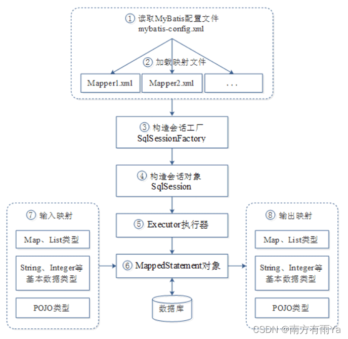

# MyBatis

## MyBatis的解析和运行原理

### 请说说MyBatis的工作原理

> 1）读取 MyBatis 配置文件：mybatis-config.xml 为 MyBatis 的全局配置文件，配置了 MyBatis 的运行环境等信息，例如数据库连接信息。
>
> 2）加载映射文件:映射文件即 SQL 映射文件，该文件中配置了操作数据库的 SQL 语句，需要在 MyBatis 配置文件 mybatis-config.xml 中加载。mybatis-config.xml 文件可以加载多个映射文件，每个文件对应数据库中的一张表。
>
> 3）构造会话工厂：通过 MyBatis 的环境等配置信息构建会话工厂 SqlSessionFactory。
>
> 4）创建会话对象：由会话工厂创建 SqlSession 对象，该对象中包含了执行 SQL 语句的所有方法。
>
> 5）Executor 执行器：MyBatis 底层定义了一个 Executor 接口来操作数据库，它将根据 SqlSession 传递的参数动态地生成需要执行的 SQL 语句，同时负责查询缓存的维护。
>
> 6）MappedStatement 对象：在 Executor 接口的执行方法中有一个 MappedStatement 类型的参数，该参数是对映射信息的封装，用于存储要映射的 SQL 语句的 id、参数等信息。
>
> 7）输入参数映射：输入参数类型可以是 Map、List 等集合类型，也可以是基本数据类型和 POJO 类型。输入参数映射过程类似于 JDBC 对 preparedStatement 对象设置参数的过程。
>
> 8）输出结果映射：输出结果类型可以是 Map、 List 等集合类型，也可以是基本数据类型和 POJO 类型。输出结果映射过程类似于 JDBC 对结果集的解析过程。
>
> 

### 为什么需要预编译

> 1. **定义：**
>
>    SQL 预编译指的是数据库驱动在发送 SQL 语句和参数给 DBMS 之前对 SQL 语句进行编译，这样 DBMS 执行 SQL 时，就不需要重新编译。
>
> 2. **为什么需要预编译**
>
>    JDBC 中使用对象 PreparedStatement 来抽象预编译语句，使用预编译。预编译阶段可以优化 SQL 的执行。预编译之后的 SQL 多数情况下可以直接执行，DBMS 不需要再次编译，越复杂的SQL，编译的复杂度将越大，预编译阶段可以合并多次操作为一个操作。同时预编译语句对象可以重复利用。把一个 SQL 预编译后产生的 PreparedStatement 对象缓存下来，下次对于同一个SQL，可以直接使用这个缓存的 PreparedState 对象。Mybatis默认情况下，将对所有的 SQL 进行预编译。

### Mybatis都有哪些Executor执行器？它们之间的区别是什么？

> Mybatis有三种基本的Executor执行器，**SimpleExecutor**、**ReuseExecutor**、**BatchExecutor**。
>
> - **SimpleExecutor**：每执行一次update或select，就开启一个Statement对象，用完立刻关闭Statement对象。
> - **ReuseExecutor**：执行update或select，以sql作为key查找Statement对象，存在就使用，不存在就创建，用完后，不关闭Statement对象，而是放置于Map<String, Statement>内，供下一次使用。简言之，就是重复使用Statement对象。
> - **BatchExecutor**：执行update（没有select，JDBC批处理不支持select），将所有sql都添加到批处理中（addBatch()），等待统一执行（executeBatch()），它缓存了多个Statement对象，每个Statement对象都是addBatch()完毕后，等待逐一执行executeBatch()批处理。与JDBC批处理相同。
>
> **作用范围**：Executor的这些特点，都严格限制在SqlSession生命周期范围内。

### Mybatis中如何指定使用哪一种Executor执行器？

> 在Mybatis配置文件中，在设置（settings）可以指定默认的ExecutorType执行器类型，也可以手动给DefaultSqlSessionFactory的创建SqlSession的方法传递ExecutorType类型参数，如SqlSession openSession(ExecutorType execType)。
>
> 配置默认的执行器。SIMPLE 就是普通的执行器；REUSE 执行器会重用预处理语句（prepared statements）； BATCH 执行器将重用语句并执行批量更新。
>

### Mybatis是否支持延迟加载？如果支持，它的实现原理是什么？

> Mybatis仅支持association关联对象和collection关联集合对象的延迟加载，association指的就是一对一，collection指的就是一对多查询。在Mybatis配置文件中，可以配置是否启用延迟加载lazyLoadingEnabled=true|false。
>
> 它的原理是，使用CGLIB创建目标对象的代理对象，当调用目标方法时，进入拦截器方法，比如调用a.getB().getName()，拦截器invoke()方法发现a.getB()是null值，那么就会单独发送事先保存好的查询关联B对象的sql，把B查询上来，然后调用a.setB(b)，于是a的对象b属性就有值了，接着完成a.getB().getName()方法的调用。这就是延迟加载的基本原理。
>
> 当然了，不光是Mybatis，几乎所有的包括Hibernate，支持延迟加载的原理都是一样的。

## 映射器

### `#{}` 和 `${}` 的区别

> - {}是占位符，预编译处理；${}是拼接符，字符串替换，没有预编译处理。
> - Mybatis在处理#{}时，#{}传入参数是以字符串传入，会将SQL中的#{}替换为?号，调用PreparedStatement的set方法来赋值。
>
> - Mybatis在处理时 ， 是 原 值 传 入 ， 就 是 把 {}时，是原值传入，就是把时，是原值传入，就是把{}替换成变量的值，相当于JDBC中的Statement编译
>
> - 变量替换后，#{} 对应的变量自动加上单引号 ‘’；变量替换后，${} 对应的变量不会加上单引号 ‘’
>
> - #{} 可以有效的防止SQL注入，提高系统安全性；${} 不能防止SQL 注入
> - #{} 的变量替换是在DBMS 中；${} 的变量替换是在 DBMS 外

### 这个Dao接口的工作原理是什么？Dao接口里的方法，参数不同时，方法能重载吗？

> Dao接口，就是人们常说的Mapper接口，接口的全限名，就是映射文件中的namespace的值，接口的方法名，就是映射文件中MappedStatement的id值，接口方法内的参数，就是传递给sql的参数。Mapper接口是没有实现类的，当调用接口方法时，接口全限名+方法名拼接字符串作为key值，可唯一定位一个MappedStatement，举例：
>
> com.mybatis3.mappers.StudentDao.findStudentById，可以唯一找到namespace为com.mybatis3.mappers.StudentDao下面id = findStudentById的MappedStatement。在Mybatis中，每一个、、、标签，都会被解析为一个MappedStatement对象。
>
> Dao接口里的方法，是不能重载的，因为是全限名+方法名的保存和寻找策略。
>
> **Dao接口的工作原理是JDK动态代理**，Mybatis运行时会使用JDK动态代理为Dao接口生成代理proxy对象，代理对象proxy会拦截接口方法，转而执行MappedStatement所代表的sql，然后将sql执行结果返回。

### Mybatis是如何将sql执行结果封装为目标对象并返回的？都有哪些映射形式？

> 第一种是使用标签，逐一定义列名和对象属性名之间的映射关系。
>
> 第二种是使用sql列的别名功能，将列别名书写为对象属性名，比如T_NAME AS NAME，对象属性名一般是name，小写，但是列名不区分大小写，Mybatis会忽略列名大小写，智能找到与之对应对象属性名，你甚至可以写成T_NAME AS NaMe，Mybatis一样可以正常工作。
>
> 有了列名与属性名的映射关系后，Mybatis通过反射创建对象，同时使用反射给对象的属性逐一赋值并返回，那些找不到映射关系的属性，是无法完成赋值的。
>

### Xml映射文件中，除了常见的select|insert|updae|delete标签之外，还有哪些标签？

> 还有很多其他的标签，、、、、，加上动态sql的9个标签，
>
> trim|where|set|foreach|if|choose|when|otherwise|bind等，
>
> 其中为sql片段标签，通过标签引入sql片段，为不支持自增的主键生成策略标签。

### Mybatis映射文件中，如果A标签通过include引用了B标签的内容，请问，B标签能否定义在A标签的后面，还是说必须定义在A标签的前面？

> 虽然Mybatis解析Xml映射文件是按照顺序解析的，但是，被引用的B标签依然可以定义在任何地方，Mybatis都可以正确识别。
>
> 原理是，Mybatis解析A标签，发现A标签引用了B标签，但是B标签尚未解析到，尚不存在，此时，Mybatis会将A标签标记为未解析状态，然后继续解析余下的标签，包含B标签，待所有标签解析完毕，Mybatis会重新解析那些被标记为未解析的标签，此时再解析A标签时，B标签已经存在，A标签也就可以正常解析完成了。
>

## 动态SQL

### Mybatis动态sql是做什么的？都有哪些动态sql？能简述一下动态sql的执行原理不？

> Mybatis动态sql可以让我们在Xml映射文件内，以标签的形式编写动态sql，完成逻辑判断和动态拼接sql的功能，Mybatis提供了9种动态sql标签trim|where|set|foreach|if|choose|when|otherwise|bind。
>
> 其执行原理为，使用OGNL从sql参数对象中计算表达式的值，根据表达式的值动态拼接sql，以此来完成动态sql的功能。

## 插件

### Mybatis是如何进行分页的？分页插件的原理是什么？

> Mybatis使用RowBounds对象进行分页，它是针对ResultSet结果集执行的内存分页，而非物理分页，可以在sql内直接书写带有物理分页的参数来完成物理分页功能，也可以使用分页插件来完成物理分页。
>
> 分页插件的基本原理是使用Mybatis提供的插件接口，实现自定义插件，在插件的拦截方法内拦截待执行的sql，然后重写sql，根据dialect方言，添加对应的物理分页语句和物理分页参数。
>
> 举例：select * from student，拦截sql后重写为：select t.* from (select * from student) t limit 0, 10
>

### 简述Mybatis的插件运行原理，以及如何编写一个插件。

> Mybatis仅可以编写针对ParameterHandler、ResultSetHandler、StatementHandler、Executor这4种接口的插件，Mybatis使用JDK的动态代理，为需要拦截的接口生成代理对象以实现接口方法拦截功能，每当执行这4种接口对象的方法时，就会进入拦截方法，具体就是InvocationHandler的invoke()方法，当然，只会拦截那些你指定需要拦截的方法。
>
> 实现Mybatis的Interceptor接口并复写intercept()方法，然后在给插件编写注解，指定要拦截哪一个接口的哪些方法即可，记住，别忘了在配置文件中配置你编写的插件。

## 缓存

### Mybatis的一级、二级缓存

> 1）一级缓存: 基于 PerpetualCache 的 HashMap 本地缓存，其存储作用域为 Session，当 Session flush 或 close 之后，该 Session 中的所有 Cache 就将清空，默认打开一级缓存。
>
> 2）二级缓存与一级缓存其机制相同，默认也是采用 PerpetualCache，HashMap 存储，不同在于其存储作用域为 Mapper(Namespace)，并且可自定义存储源，如 Ehcache。默认不打开二级缓存，要开启二级缓存，使用二级缓存属性类需要实现Serializable序列化接口(可用来保存对象的状态),可在它的映射文件中配置 ；
>
> 3）对于缓存数据更新机制，当某一个作用域(一级缓存 Session/二级缓存Namespaces)的进行了C/U/D 操作后，默认该作用域下所有 select 中的缓存将被 clear。