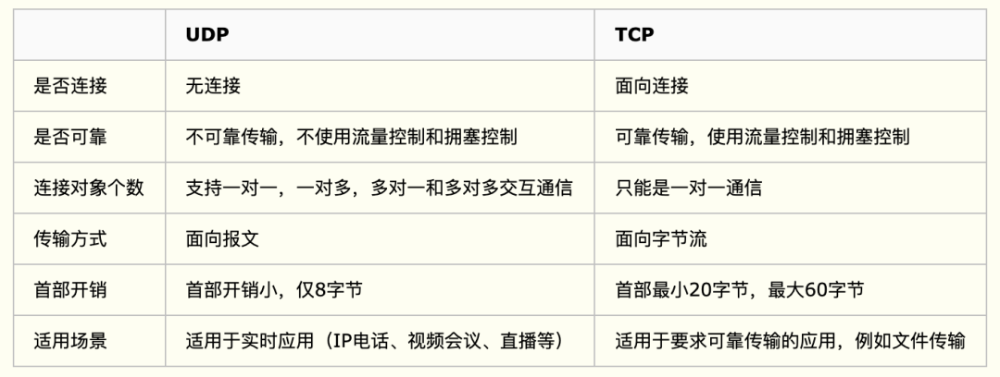

# 计算机网络篇

## 1.计算机网络基础

### 网络协议是什么？

> 在计算机网络要做到有条不紊地交换数据，就必须遵守一些事先约定好的规则，比如交换数据的格式、是否需要发送一个应答信息。这些规则被称为网络协议。

### OSI 七层模型是什么？每一层的作用是什么？

> - 应用层（Application）：为用户的应用程序提供网络服务
> - 表示层（Presentation）：将信息表示为一定形式和格式的数据流
> - 会话层（Session）：负责通信主机之间会话的建立、管理和拆除，协调通信双方的会话
> - 传输层（Transport）：负责通信主机间端到端的连接
> - 网络层（Network）：负责将分组从源机送到目的机，包括寻址和最优路径选择等
> - 数据链路层（Data Link）：提供可靠的帧传递，实现差错控制、流控等等
> - 物理层（Physical）：提供透明的比特流（01流）传递
>
> 

### TCP/IP 四层模型是什么？每一层的作用是什么？

> - **应用层**	应用层处于四层模型的顶部，他决定了向用户提供应用服务时通信的活动。
>
>   讲人话就是，这一层是直接作用在你的操作系统内核中，用于会话管理、数据加密/解密、为应用程序提供服务等。
>
> - **传输层**	建立、维护、管理网络连接中两台计算机端到端的数据传输。我们常说的TCP/UDP就是作用于这一层。
>
> - **网络层**	处理网络上流动的数据包。规定了通过怎样的路径到达对方计算机，并把数据包传送给对方（IP选址、路由选择）。
>
> - **链路层**	用来处理链接网络的硬件部分，包括控制操作系统、驱动、网卡等等。
>
> 
>
> 

### 为什么网络要分层？

> 说到分层，我们先从我们平时使用框架开发一个后台程序来说，我们往往会按照每一层做不同的事情的原则将系统分为三层（复杂的系统分层会更多）:
>
> 1. Repository（数据库操作）
> 2. Service（业务操作）
> 3. Controller（前后端数据交互）
>
> **复杂的系统需要分层，因为每一层都需要专注于一类事情。网络分层的原因也是一样，每一层只专注于做一类事情。**
>
> 好了，再来说回：“为什么网络要分层？”。我觉得主要有 3 方面的原因：
>
> 1. **各层之间相互独立**：各层之间相互独立，各层之间不需要关心其他层是如何实现的，只需要知道自己如何调用下层提供好的功能就可以了（可以简单理解为接口调用）**。这个和我们对开发时系统进行分层是一个道理。**
> 2. **提高了整体灵活性** ：每一层都可以使用最适合的技术来实现，你只需要保证你提供的功能以及暴露的接口的规则没有改变就行了。**这个和我们平时开发系统的时候要求的高内聚、低耦合的原则也是可以对应上的。**
> 3. **大问题化小** ： 分层可以将复杂的网络间题分解为许多比较小的、界线比较清晰简单的小问题来处理和解决。这样使得复杂的计算机网络系统变得易于设计，实现和标准化。 **这个和我们平时开发的时候，一般会将系统功能分解，然后将复杂的问题分解为容易理解的更小的问题是相对应的，这些较小的问题具有更好的边界（目标和接口）定义。
>
> !> 网络协议分层的缺点： 功能可能出现在多个层里，产生了额外开销。

### 应用层有哪些常见的协议？

> - HTTP 协议（超文本传输协议，网页浏览常用的协议）
> - DHCP 协议（动态主机配置）
> - DNS 系统原理（域名系统）
> - FTP 协议（文件传输协议）
> - Telnet协议（远程登陆协议）
> - 电子邮件协议等（SMTP、POP3、IMAP）

------

## 2.TCP 与 UDP

### UDP 和 TCP 的特点与区别

> - **连接方式**：TCP 是面向连接的（三次握手建立连接），UDP 是无连接的即发送数据前不需要先建立链接。
> - **可靠性**：TCP （面向连接）提供可靠的服务。所以通过 TCP 连接传送的数据，不丢失，不重复，且按序到达；UDP （无连接）不保证可靠交付，尽最大努力交付。 （并且因为 TCP 可靠，面向连接，不会丢失数据因此适合大数据量的交换）
> -  **传输方式**：TCP 是面向字节流；UDP 面向报文，并且网络出现拥塞不会使得发送速率降低（因此会出现丢包，对实时的应用比如 IP 电话和视频会议等）。
> -  **连接对象方式**：TCP 只能是 1 对 1 的，UDP 支持 1 对 1,1 对多。
> -  **首部开销**：TCP 的首部较大为 20 字节，而 UDP 只有 8 字节。
> -  **适用场景**：TCP 适用于要求可靠性传输的应用（例如文件传输），而 UDP 适用于实时应用（例如IP电话、视频会议、直播等）。
> -  TCP 是面向连接的可靠性传输，而 UDP 是不可靠的
>
> 

### TCP数据包的结构，包含哪些字段？TCP的拥塞控制过程？

TCP数据包的结构，包含哪些字段？TCP的拥塞控制过程？

TCP 报文 (Segment)，包括首部和数据部分。


TCP 报文段首部的前20个字节是固定的，后面有 4N 字节是根据需要而增加的。


**拥塞现象：**当网络的吞吐量达到一定的限制后，会发生拥塞现象，那么此时发送的数据包会因为延迟无法到达接收端，因为超时重传机制所以发送端会重新发送数据包，那么网络带宽中本来就很拥塞，那么的话再发数据包就会更加拥塞，由此会形成恶性循环，如果不加控制的话，那么最终网络的有效吞吐量将接近为0.

拥塞控制的过程分为四个阶段：慢启动、拥塞避免、快重传、快恢复

- 慢启动：慢启动阶段思路是不要一开始就发送大量的数据，先探测一下网络的拥塞程度，也就是说由小到大逐渐增加拥塞窗口的大小
- 拥塞避免：
- 快重传/快恢复：

### TCP 的三次握手和四次挥手⭐

<!-- tabs:start -->

#### **三次握手**

> 三次握手的过程给面试官甩一张图：
>
> - 第一次握手：客户端要向服务端发起连接请求，首先客户端随机生成一个起始序列号ISN(比如是100)，那客户端向服务端发送的报文段包含SYN标志位(也就是SYN=1)，序列号seq=100。
>
> - 第二次握手：服务端收到客户端发过来的报文后，发现SYN=1，知道这是一个连接请求，于是将客户端的起始序列号100存起来，并且随机生成一个服务端的起始序列号(比如是300)。然后给客户端回复一段报文，回复报文包含SYN和ACK标志(也就是SYN=1,ACK=1)、序列号seq=300、确认号ack=101(客户端发过来的序列号+1)。
>
> - 第三次握手：客户端收到服务端的回复后发现ACK=1并且ack=101,于是知道服务端已经收到了序列号为100的那段报文；同时发现SYN=1，知道了服务端同意了这次连接，于是就将服务端的序列号300给存下来。然后客户端再回复一段报文给服务端，报文包含ACK标志位(ACK=1)、ack=301(服务端序列号+1)、seq=101(第一次握手时发送报文是占据一个序列号的，所以这次seq就从101开始，需要注意的是不携带数据的ACK报文是不占据序列号的，所以后面第一次正式发送数据时seq还是101)。当服务端收到报文后发现ACK=1并且ack=301，就知道客户端收到序列号为300的报文了，就这样客户端和服务端通过TCP建立了连接。
>
> 
>

#### **四次挥手**

> 四次挥手的过程再给面试官甩一张图：
>
> 比如客户端初始化的序列号ISA=100，服务端初始化的序列号ISA=300。TCP连接成功后客户端总共发送了1000个字节的数据，服务端在客户端发FIN报文前总共回复了2000个字节的数据。
>
> - 第一次挥手：当客户端的数据都传输完成后，客户端向服务端发出连接释放报文(当然数据没发完时也可以发送连接释放报文并停止发送数据)，释放连接报文包含FIN标志位(FIN=1)、序列号seq=1101(100+1+1000，其中的1是建立连接时占的一个序列号)。需要注意的是客户端发出FIN报文段后只是不能发数据了，但是还可以正常收数据；另外FIN报文段即使不携带数据也要占据一个序列号。
> - 第二次挥手：服务端收到客户端发的FIN报文后给客户端回复确认报文，确认报文包含ACK标志位(ACK=1)、确认号ack=1102(客户端FIN报文序列号1101+1)、序列号seq=2300(300+2000)。此时服务端处于关闭等待状态，而不是立马给客户端发FIN报文，这个状态还要持续一段时间，因为服务端可能还有数据没发完。
> - 第三次挥手：服务端将最后数据(比如50个字节)发送完毕后就向客户端发出连接释放报文，报文包含FIN和ACK标志位(FIN=1,ACK=1)、确认号和第二次挥手一样ack=1102、序列号seq=2350(2300+50)。
> - 第四次挥手：客户端收到服务端发的FIN报文后，向服务端发出确认报文，确认报文包含ACK标志位(ACK=1)、确认号ack=2351、序列号seq=1102。注意客户端发出确认报文后不是立马释放TCP连接，而是要经过2MSL(最长报文段寿命的2倍时长)后才释放TCP连接。而服务端一旦收到客户端发出的确认报文就会立马释放TCP连接，所以服务端结束TCP连接的时间要比客户端早一些。
>
> 
>

<!-- tabs:end -->

### TCP 的三次握手（为什么三次？）

> 因为需要考虑连接时丢包的问题，如果只握手2次，第二次握手时如果服务端发给客户端的确认报文段丢失，此时服务端已经准备好了收发数(可以理解服务端已经连接成功)据，而客户端一直没收到服务端的确认报文，所以客户端就不知道服务端是否已经准备好了(可以理解为客户端未连接成功)，这种情况下客户端不会给服务端发数据，也会忽略服务端发过来的数据。
>
> 如果是三次握手，即便发生丢包也不会有问题，比如如果第三次握手客户端发的确认ack报文丢失，服务端在一段时间内没有收到确认ack报文的话就会重新进行第二次握手，也就是服务端会重发SYN报文段，客户端收到重发的报文段后会再次给服务端发送确认ack报文。

### TCP 的四次挥手（为什么四次？）

> 因为只有在客户端和服务端都没有数据要发送的时候才能断开TCP。而客户端发出FIN报文时只能保证客户端没有数据发了，服务端还有没有数据发客户端是不知道的。而服务端收到客户端的FIN报文后只能先回复客户端一个确认报文来告诉客户端我服务端已经收到你的FIN报文了，但我服务端还有一些数据没发完，等这些数据发完了服务端才能给客户端发FIN报文(所以不能一次性将确认报文和FIN报文发给客户端，就是这里多出来了一次)。

### 为什么客户端发出第四次挥手的确认报文后要等2MSL的时间才能释放TCP连接？⭐

> 这里同样是要考虑丢包的问题，如果第四次挥手的报文丢失，服务端没收到确认ack报文就会重发第三次挥手的报文，这样报文一去一回最长时间就是2MSL，所以需要等这么长时间来确认服务端确实已经收到了。

### 如果已经建立了连接，但是客户端突然出现故障了怎么办？

> TCP设有一个保活计时器，客户端如果出现故障，服务器不能一直等下去，白白浪费资源。服务器每收到一次客户端的请求后都会重新复位这个计时器，时间通常是设置为2小时，若两小时还没有收到客户端的任何数据，服务器就会发送一个探测报文段，以后每隔75秒钟发送一次。若一连发送10个探测报文仍然没反应，服务器就认为客户端出了故障，接着就关闭连接。

### TCP 长连接和短连接的区别

> **短连接：**Client 向 Server 发送消息，Server 回应 Client，然后一次读写就完成了，这时候双方任何一个都可以发起 close 操作，不过一般都是 Client 先发起 close 操作。**短连接一般只会在 Client/Server 间传递一次读写操作。**
>
> 短连接的优点：管理起来比较简单，建立存在的连接都是有用的连接，不需要额外的控制手段。
>
> **长连接：** **Client 与 Server 完成一次读写之后，它们之间的连接并不会主动关闭，后续的读写操作会继续使用这个连接。**
>
> 在长连接的应用场景下，Client 端一般不会主动关闭它们之间的连接，Client 与 Server 之间的连接如果一直不关闭的话，随着客户端连接越来越多，Server 压力也越来越大，这时候 Server 端需要采取一些策略，如关闭一些长时间没有读写事件发生的连接，这样可以避免一些恶意连接导致 Server 端服务受损；如果条件再允许可以以客户端为颗粒度，限制每个客户端的最大长连接数，从而避免某个客户端连累后端的服务。
>
> 长连接和短连接的产生在于 Client 和 Server 采取的关闭策略，具体的应用场景采用具体的策略。

### TCP粘包、拆包及解决办法⭐

> 假设 Client 向 Server 连续发送了两个数据包，用 packet1 和 packet2 来表示，那么服务端收到的数据可以分为三种情况，现列举如下：
>
> 
>
> 
>
> 
>
> `为什么会发生 TCP 粘包、拆包？`
>
> - 要发送的数据**大于 TCP 发送缓冲区剩余空间大小**，将会发生拆包。
> - 待发送数据**大于 MSS**（最大报文长度），TCP 在传输前将进行拆包。
> - 要发送的数据**小于 TCP 发送缓冲区的大小**，TCP 将多次写入缓冲区的数据一次发送出去，将会发生粘包。
> - 接收数据端的应用层**没有及时读取接收**缓冲区中的数据，将发生粘包。
>
> `粘包、拆包解决办法`
>
> 由于 TCP 本身是面向字节流的，无法理解上层的业务数据，所以在底层是无法保证数据包不被拆分和重组的，这个问题只能通过上层的应用协议栈设计来解决，根据业界的主流协议的解决方案，归纳如下：
>
> - **消息定长：**发送端将每个数据包封装为固定长度（不够的可以通过补 0 填充），这样接收端每次接收缓冲区中读取固定长度的数据就自然而然的把每个数据包拆分开来。
> - **设置消息边界：**服务端从网络流中按消息边界分离出消息内容。在包尾增加回车换行符进行分割，例如 FTP 协议。
> - **将消息分为消息头和消息体：**消息头中包含表示消息总长度（或者消息体长度）的字段。

### TCP 是如何实现数据的可靠性？⭐

> 一句话：通过`校验和`、`序列号`、`确认应答`、`超时重传`、`连接管理`、`流量控制`、`拥塞控制`等机制来保证可靠性。
>
> 1. **校验和**
>
>    在数据传输过程中，将发送的数据段都当做一个16位的整数，将这些整数加起来，并且前面的进位不能丢弃，补在最后，然后取反，得到校验和。
>
>    发送方：在发送数据之前计算校验和，并进行校验和的填充。接收方：收到数据后，对数据以同样的方式进行计算，求出校验和，与发送方进行比较。
>
> 2. **序列号**
>
>    TCP 传输时将每个字节的数据都进行了编号，这就是序列号。序列号的作用不仅仅是应答作用，有了序列号能够将接收到的数据根据序列号进行排序，并且去掉重复的数据。
>
> 3. **确认应答**
>
>    TCP 传输过程中，每次接收方接收到数据后，都会对传输方进行确认应答，也就是发送 ACK 报文，这个 ACK 报文中带有对应的确认序列号，告诉发送方，接收了哪些数据，下一次数据从哪里传。
>
> 4. **超时重传**
>
>    在进行 TCP 传输时，由于存在确认应答与序列号机制，也就是说发送方发送一部分数据后，都会等待接收方发送的 ACK 报文，并解析 ACK 报文，判断数据是否传输成功。如果发送方发送完数据后，迟迟都没有接收到接收方传来的 ACK 报文，那么就对刚刚发送的数据进行重发。
>
> 5. **连接管理**
>
>    就是指三次握手、四次挥手的过程。
>
> 6. **流量控制**
>
>    如果发送方的发送速度太快，会导致接收方的接收缓冲区填充满了，这时候继续传输数据，就会造成大量丢包，进而引起丢包重传等等一系列问题。TCP 支持根据接收端的处理能力来决定发送端的发送速度，这就是流量控制机制。
>
>    具体实现方式：接收端将自己的接收缓冲区大小放入 TCP 首部的『窗口大小』字段中，通过 ACK 通知发送端。
>
> 7. **拥塞控制**
>
>    TCP 传输过程中一开始就发送大量数据，如果当时网络非常拥堵，可能会造成拥堵加剧。所以 TCP 引入了`慢启动机制`，在开始发送数据的时候，先发少量的数据探探路。
>
>    TCP 的拥塞控制采用了四种算法，即 **慢启动** 、 **拥塞避免** 、**快重传** 和 **快恢复**。

------

## 3.HTTP

### HTTPS 采用的是对称加密还是非对称加密？具体说说其加密过程⭐

> **HTTPS其实就是将HTTP的数据包再通过SSL/TLS加密后传输**。
>
> 说到 HTTPS 的加密过程，就不得不提一下加密方式的分类，主要分为 **对称加密** 与 **非对称加密**
>
> - 对称加密，顾名思义，对称，也就是指使用同一个秘钥来进行加秘和解密，放到具体场景，也就是通讯双方使用同一个秘钥，一方加密发送信息，另一方解密密文获取信息。经典的对称加密算法有 AES 等
> - 非对称秘钥指的是通过特殊手段，实现的一种加密方式，这种方式能够通过一个公钥进行加密，然后通过私钥进行解密，而公钥与私钥不同，因此成为非对称，典型的非对称加密算法有 RSA 等
>
> **HTTPS的加解密流程**
>
> 1. 用户在浏览器发起HTTPS请求（如 https://www.mogu.com/ ），默认使用服务端的443端口进行连接；
> 2. HTTPS需要使用一套**CA数字证书**，证书内会附带一个**公钥Pub**，而与之对应的**私钥Private**保留在服务端不公开；
> 3. 服务端收到请求，返回配置好的包含**公钥Pub**的证书给客户端；
> 4. 客户端收到**证书**，校验合法性，主要包括是否在有效期内、证书的域名与请求的域名是否匹配，上一级证书是否有效（递归判断，直到判断到系统内置或浏览器配置好的根证书），如果不通过，则显示HTTPS警告信息，如果通过则继续；
> 5. 客户端生成一个用于对称加密的**随机Key**，并用证书内的**公钥Pub**进行加密，发送给服务端；
> 6. 服务端收到**随机Key**的密文，使用与**公钥Pub**配对的**私钥Private**进行解密，得到客户端真正想发送的**随机Key**；
> 7. 服务端使用客户端发送过来的**随机Key**对要传输的HTTP数据进行对称加密，将密文返回客户端；
> 8. 客户端使用**随机Key**对称解密密文，得到HTTP数据明文；
> 9. 后续HTTPS请求使用之前交换好的**随机Key**进行对称加解密。

### 讲一下 http1.1 和 http2 有什么区别？

> **HTTP1.1**
>
> - 持久连接
> - 请求管道化
> - 增加缓存处理（新的字段如cache-control）
> - 增加 Host 字段、支持断点传输等
>
> **HTTP2.0**
>
> - 二进制分帧
> - 多路复用（或连接共享）
> - 头部压缩
> - 服务器推送

### HTTP 和 HTTPS 有什么区别？

> - HTTPS 协议需要到 CA 申请证书，一般免费证书较少，因而需要一定费用。
> - HTTP 是超文本传输协议，信息是明文传输，HTTPS 则是具有安全性的 SSL 加密传输协议。
> - HTTP 和 HTTPS 使用的是完全不同的连接方式，用的端口也不一样，前者是80，后者是443。
> - HTTP 的连接很简单，是无状态的；HTTPS 协议是由 SSL+HTTP 协议构建的可进行加密传输、身份认证的网络协议，比 HTTP 协议安全。

### 你知道对称加密和非对称加密的区别和原理吗？

> 对称密钥加密是指加密和解密使用同一个密钥的方式，这种方式存在的最大问题就是密钥发送问题，即`如何安全地将密钥发给对方`;
>
> 而非对称加密是指使用一对非对称密钥，即`公钥`和`私钥`，公钥可以随意发布，但私钥只有自己知道。发送密文的一方使用对方的公钥进行加密处理，对方接收到加密信息后，使用自己的私钥进行解密。
>
> 由于非对称加密的方式不需要发送用来解密的私钥，所以可以`保证安全性`；但是和对称加密比起来，它比较`慢`，所以我们还是要用对称加密来传送消息，但对称加密所使用的密钥我们可以通过非对称加密的方式发送出去。

### HTTP 状态码有哪些？

> 1×× : 请求处理中，请求已被接受，正在处理
>
> 2×× : 请求成功，请求被成功处理 200 OK
>
> 3×× : 重定向，要完成请求必须进行进一步处理 301 : 永久性转移 302 ：暂时性转移 304 ：已缓存
>
> 4×× : 客户端错误，请求不合法 400：Bad Request,请求有语法问题 403：拒绝请求 404：客户端所访问的页面不存在
>
> 5×× : 服务器端错误，服务器不能处理合法请求 500 ：服务器内部错误 503 ：服务不可用，稍等

### Get与POST的区别

> 1. GET 一般用来从服务器上获取资源，POST 一般用来创建资源；
> 2. GET 是幂等的，即读取同一个资源，总是得到相同的数据，而 POST 不是幂等的。GET 不会改变服务器上的资源，而 POST 会对服务器资源进行改变；
> 3. 从请求参数形式上看，GET 请求的数据会附在`URL之后`；而 POST 请求会把提交的数据则放置在是HTTP请求报文的`请求体`中。
> 4. POST 的安全性要比 GET 的安全性高，因为 GET 请求提交的数据将明文出现在 URL 上，而 POST 请求参数则被包装到请求体中，相对更安全。
> 5. GET 请求的长度受限于浏览器或服务器对URL长度的限制，允许发送的数据量比较小，而POST请求则是没有大小限制的。

### DNS 的寻址过程你知道吗？⭐

> 1. 在浏览器中输入`www.baidu.com`域名，操作系统会先检查自己本地的 hosts 文件是否有这个网址映射关系，如果有就先调用这个IP地址映射，完成域名解析。
> 2. 如果 hosts 里没有这个域名的映射，则查找本地 DNS 解析器缓存，是否有这个网址映射关系，如果有直接返回，完成域名解析。
> 3. 如果 hosts 与本地 DNS 解析器缓存都没有相应的网址映射关系，首先会找 TCP/IP 参数中设置的首选 DNS 服务器，在此我们叫它本地 DNS 服务器，此服务器收到查询时，如果要查询的域名，包含在本地配置区域资源中，则返回解析结果给客户机，完成域名解析，此解析具有权威性。
> 4. 如果要查询的域名，不由本地 DNS 服务器区域解析，但该服务器已缓存了此网址映射关系，则调用这个 IP 地址映射，完成域名解析，此解析不具有权威性。
> 5. 如果本地 DNS 服务器本地区域文件与缓存解析都失效，则根据本地 DNS 服务器的设置（是否设置转发器）进行查询，如果未用转发模式，本地 DNS 就把请求发至13台根 DNS ，根 DNS 服务器收到请求后会判断这个域名(.com)是谁来授权管理，并会返回一个负责该顶级域名服务器的一个IP。本地 DNS 服务器收到IP信息后，将会联系负责 .com 域的这台服务器。这台负责 .com 域的服务器收到请求后，如果自己无法解析，它就会找一个管理.com域的下一级DNS服务器地址(baidu.com)给本地 DNS 服务器。当本地 DNS 服务器收到这个地址后，就会找 baidu.com 域服务器，重复上面的动作，进行查询，直至找到 www.baidu.com 主机。
> 6. 如果用的是转发模式，此 DNS 服务器就会把请求转发至上一级 DNS 服务器，由上一级服务器进行解析，上一级服务器如果不能解析，或找根 DNS 或把转请求转至上上级，以此循环。不管是本地 DNS 服务器用是是转发，还是根提示，最后都是把结果返回给本地 DNS 服务器，由此 DNS 服务器再返回给客户机。

### 在浏览器中输入一个 www.baidu.com 后执行的全部过程？⭐

> **总体流程**
>
> 域名解析 -> 建立TCP连接（三次握手）-> 发起http请求 -> 服务器响应http请求，浏览器得到html代码 -> 浏览器解析html代码，并请求html代码中的资源（如 js、css、图片等）-> 浏览器对页面进行渲染呈献给用户。

## 4.网络安全

### 什么是 XSS 攻击？

> XSS 即（Cross Site Scripting）中文名称为：跨站脚本攻击。XSS的重点不在于跨站点，而在于脚本的执行。
>
> XSS的原理是：
>
> 恶意攻击者在web页面中会插入一些恶意的script代码。当用户浏览该页面的时候，那么嵌入到web页面中script代码会执行，因此会达到恶意攻击用户的目的。
>
> XSS攻击最主要有如下分类：`反射型`、`存储型`、及 `DOM-based型`。反射性和DOM-baseed型可以归类为`非持久性XSS攻击`。存储型可以归类为`持久性XSS攻击`。
>
> ------
>
> 这里就采用Spring boot+Filter的方式实现一个Xss的全局过滤器
>
> Spring boot实现一个Xss过滤器, 常用的有两种方式:
>
> **第一种**：
>
> - 自定义过滤器
> - 重写HttpServletRequestWrapper、重写getHeader()、getParameter()、getParameterValues()、getInputStream()实现对传统“键值对”传参方式的过滤
> - 重写getInputStream()实现对Json方式传参的过滤,也就是@RequestBody参数
>
> **第二种**：
>
> - 自定义序列化器, 对MappingJackson2HttpMessageConverter 的objectMapper做设置.
>   重写JsonSerializer.serialize()实现对出参的过滤 (PS: 数据原样保存, 取出来的时候转义)
>   重写JsonDeserializer.deserialize()实现对入参的过滤 (PS: 数据转义后保存)

### 什么是跨站攻击CSRF？

> CSRF（Cross Site Request Forgery，跨站域请求伪造）是一种网络的攻击方式，它在 2007 年曾被列为互联网 20 大安全隐患之一，也被称为『One Click Attack』或者 『Session Riding』，通常缩写为`CSRF`或者`XSRF`，是一种对网站的恶意利用。
>
> 攻击通过在授权用户访问的页面中包含链接或者脚本的方式工作。
>
> 一个简单的例子：
>
> - 用户小z登录了网站A，同时打开网站B
> - 网站B隐蔽的发送一个请求至网站A
> - 网站A通过session、cookie等身份标记判断是用户小z，执行对应操作
>
> 这样网站B内的非法代码就盗用了用户小z的身份，在小z不知情的情况下执行了攻击者需要的操作，这就是跨站请求伪造。
>
> ------
>
> **CSRF 防御，一个核心思路就是在前端请求中，添加一个随机数。**
>
> 我们将服务端生成的随机数放在 Cookie 中，前端需要从 Cookie 中自己提取出来 `_csrf` 参数，然后拼接成参数传递给后端
>
> Spring Security 也提供了解决方案。
>
> ```java
> @Configuration
> public class SecurityConfig extends WebSecurityConfigurerAdapter {
>     @Override
>     protected void configure(HttpSecurity http) throws Exception {
>         http.authorizeRequests().anyRequest().authenticated()
>                 .and()
>                 .formLogin()
>                 .and()
>    .csrf().csrfTokenRepository(CookieCsrfTokenRepository.withHttpOnlyFalse());
>     }
> }
> ```

## 难度题型

### 1.阿里云面试：拔掉网线后， 原本的 TCP 连接还存在吗？

> [具体详情](https://mp.weixin.qq.com/s/0YFsUWL6e9r_aDrCZeTK3w)
>
> 客户端拔掉网线后，并不会直接影响 TCP 连接状态。所以，拔掉网线后，TCP 连接是否还会存在，关键要看拔掉网线之后，有没有进行数据传输。
>
> 有数据传输的情况：
>
> - 在客户端拔掉网线后，如果服务端发送了数据报文，那么在服务端重传次数没有达到最大值之前，客户端就插回了网线，那么双方原本的 TCP 连接还是能正常存在，就好像什么事情都没有发生。
> - 在客户端拔掉网线后，如果服务端发送了数据报文，在客户端插回网线之前，服务端重传次数达到了最大值时，服务端就会断开 TCP 连接。等到客户端插回网线后，向服务端发送了数据，因为服务端已经断开了与客户端相同四元组的 TCP 连接，所以就会回 RST 报文，客户端收到后就会断开 TCP 连接。至此， 双方的 TCP 连接都断开了。
>
> 没有数据传输的情况：
>
> - 如果双方都没有开启 TCP keepalive 机制，那么在客户端拔掉网线后，如果客户端一直不插回网线，那么客户端和服务端的 TCP 连接状态将会一直保持存在。
> - 如果双方都开启了 TCP keepalive 机制，那么在客户端拔掉网线后，如果客户端一直不插回网线，TCP keepalive 机制会探测到对方的 TCP 连接没有存活，于是就会断开 TCP 连接。而如果在 TCP 探测期间，客户端插回了网线，那么双方原本的 TCP 连接还是能正常存在。
>
> 除了客户端拔掉网线的场景，还有客户端「宕机和杀死进程」的两种场景。
>
> 第一个场景，客户端宕机这件事跟拔掉网线是一样无法被服务端的感知的，所以如果在没有数据传输，并且没有开启 TCP keepalive 机制时，，**服务端的 TCP 连接将会一直处于 ESTABLISHED 连接状态**，直到服务端重启进程。
>
> 所以，我们可以得知一个点。在没有使用 TCP 保活机制，且双方不传输数据的情况下，一方的 TCP 连接处在 ESTABLISHED 状态时，并不代表另一方的 TCP 连接还一定是正常的。
>
> 第二个场景，杀死客户端的进程后，客户端的内核就会向服务端发送 FIN 报文，**与客户端进行四次挥手**。
>
> 所以，即使没有开启 TCP keepalive，且双方也没有数据交互的情况下，如果其中一方的进程发生了崩溃，这个过程操作系统是可以感知的到的，于是就会发送 FIN 报文给对方，然后与对方进行 TCP 四次挥手。

## 面试题收集

### 传输网页用的udp还是tcp

> 1. 首先，http、tcp、udp并不是在一个层（osi七层模型）中，http在应用层，tcp和udp在传输层。
>
> 2. http是基于tcp的，因为发送http请求时，会先进行tcp三次握手的连接。
>
> 3. http的长连接与短连接，其实就是tcp的长连接与短连接。http1.1开始默认使用长连接，也就是 connection 默认使用 keep-alive关键字。长连接就是只需要在第一次连接时进行tcp三次握手，接下来就不需要了，可以一直使用这个连接，不会立即关闭，与短连接不同。短连接是，每次client和server进行http操作就建立一个连接，请求结束就中断连接。虽然http1.0支持长连接，但是默认的还是短连接。

