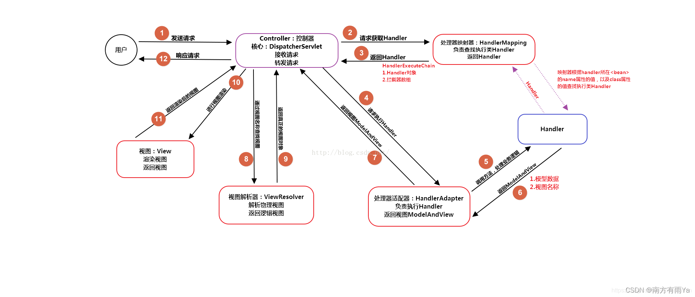

# SpringMVC

### Spring MVC 的核心组件有哪些？

> 记住了下面这些组件，也就记住了 SpringMVC 的工作原理。
>
> - **`DispatcherServlet`** ：**核心的中央处理器**，负责接收请求、分发，并给予客户端响应。
> - **`HandlerMapping`** ：**处理器映射器**，根据 uri 去匹配查找能处理的 `Handler` ，并会将请求涉及到的拦截器和 `Handler` 一起封装。
> - **`HandlerAdapter`** ：**处理器适配器**，根据 `HandlerMapping` 找到的 `Handler` ，适配执行对应的 `Handler`；
> - **`Handler`** ：**请求处理器**，处理实际请求的处理器。
> - **`ViewResolver`** ：**视图解析器**，根据 `Handler` 返回的逻辑视图 / 视图，解析并渲染真正的视图，并传递给 `DispatcherServlet` 响应客户端

### MVC流程

> 1. 用户发送请求至前端控制器DispatcherServlet；
> 2. DispatcherServlet收到请求后，调用HandlerMapping处理器映射器，请求获取Handle；
> 3. 处理器映射器根据请求url找到具体的处理器，生成处理器对象及处理器拦截器(如果有则生成)一并返回给DispatcherServlet；
> 4. DispatcherServlet 调用 HandlerAdapter处理器适配器；
> 5. HandlerAdapter 经过适配调用 具体处理器(Handler，也叫后端控制器)；
> 6. Handler执行完成返回ModelAndView；
> 7. HandlerAdapter将Handler执行结果ModelAndView返回给DispatcherServlet；
> 8. DispatcherServlet将ModelAndView传给ViewResolver视图解析器进行解析；
> 9. ViewResolver解析后返回具体View；
> 10. DispatcherServlet对View进行渲染视图（即将模型数据填充至视图中）
> 11. DispatcherServlet响应用户。
>
> 

### MVC是什么？MVC设计模式的好处有哪些

> mvc是一种设计模式（设计模式就是日常开发中编写代码的一种好的方法和经验的总结）。模型（model）-视图（view）-控制器（controller），三层架构的设计模式。用于实现前端页面的展现与后端业务数据处理的分离。
>
> mvc设计模式的好处
>
> 分层设计，实现了业务系统各个组件之间的解耦，有利于业务系统的可扩展性，可维护性。
>
> 有利于系统的并行开发，提升开发效率。

